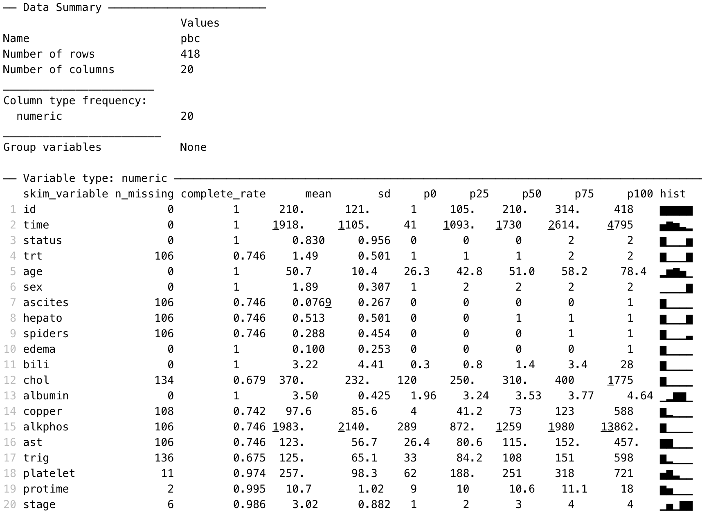

# Introduction to R and RStudio

INCLUDE:

-   <https://ubco-biology.github.io/BIOL202/>

-   <https://r4stats.com/articles/why-r-is-hard-to-learn/>

-   how to get help (online, google, etc)

-   don't give up!

-   tidyverse?

## Learning outcomes {.unnumbered}

By the end of this Module, you will be able to:

-   understand the difference between R and RStudio
-   navigate the RStudio interface
-   input and import data into R
-   use R to summarise data
-   perform basic data transformations
-   understand the difference between saving R data and saving R output
-   copy R output to a standard word processing package

## Part 1: An introduction to R {.unnumbered}

"R is a language and environment for statistical computing and graphics." [Link](https://www.r-project.org/about.html). It is an open-source programming language, used mainly for statistics (including biostatistics) and data science.

The aim of these notes is to introduce the R language within the RStudio environment, and to introduce the commands and procedures that are directly relevant to this course. There is so much more to R than we can cover in these notes. Relevant information will be provided throughout the course, and we will provide further references that you can explore if you are interested.

## R vs RStudio

At its heart, R is a programming language. When you install R on your computer, you are installing the language and its resources, as well as a very basic interface for using R. You can write and run R code using the basic R app, but we don't recommend it.

RStudio is an "Integrated Development Environment" that runs R while also providing useful tools to help you as you're writing code and analysing data. You can think of R as an engine which does the work, and RStudio as a car that uses the engine, but also provides useful tools to help you drive.

|                       R: Don't use this                        |                            RStudio: Use this instead                             |
|:----------------------------------:|:----------------------------------:|
|  |  |

## Installing R and RSudio

### To install R on your computer

1.  Download the R installer from:
    a.  for Windows: <https://cran.r-project.org/bin/windows/base/>
    b.  for MacOS: <https://cran.r-project.org/bin/macosx/>
2.  Install R by running the installer and following the installation instructions. The default settings are fine.
    -   **Note for macOS:** if you are running macOS 10.8 or later, you will need to install an additional application called XQuartz, which is available at <https://www.xquartz.org/>. Download the latest installer (XQuartz-2.8.1.dmg as of April 2022), and install it in the usual way.
3.  Open the R program. You should see a screen as below:

```{r echo=FALSE, fig.show="hold", out.width="80%"}
knitr::include_graphics("img/R-screenshot.png")
```

Near the bottom of the R screen, you will find the "\>" symbol which represents the command line. If you type `1 + 2` into the command line and then hit enter you should get:

`[1] 3`

This is R performing your calculation, with the `[1]` indicating that the solution to `1 + 2` is a single number (the number 3).

At this point, close R - we will not interact with R like this in the future. You can close R by typing `quit()` at the command prompt, followed by the return key, or in the usual way of closing an application in your operating system. There is no need to save anything here if prompted.

### To install RStudio on your computer

1.  Make sure you have already installed R, and verified that it is working.
2.  Download the RStudio desktop installer at: <https://www.rstudio.com/products/rstudio/download>. Ensure that you select the RStudio Desktop (Free) installer in the first column.
3.  Install RStudio by running the installer and following the installation instructions. The default settings are fine.
4.  Open RStudio, which will appear as below:

```{r echo=FALSE, fig.show="hold", out.width="100%"}
knitr::include_graphics("img/RStudio-screenshot-01.png")
```

Locate the command line symbol "\>" at the bottom of the left-hand panel. Type `1 + 2` into the command line and hit enter, and you will see:

`[1] 3`

This confirms that RStudio is running correctly, and can use the R language to correctly calculate the sum between 1 and 2!

RStudio currently comprises three window panes, and we will discuss these later.

## A simple R analysis {#simpleR}

In this very brief section, we will introduce R by calculating the average of six ages.

To begin, open a new R Script by choosing **File \> New file \> R Script** . A script (or a program) is a collection of commands that are sequentially processed by R. You can also type Ctrl+Shift+N in Windows, or Command+Shift+N in MacOS to open a new script in RStudio, or click the **New File** button at the top of the RStudio window.

You should now see four window panes, as below. In the top-left window, type the following (replacing my name with yours, and including today's date):

```{r eval=FALSE}
# Author: Timothy Dobbins
# Date: 5 April 2022
# Purpose: My first R script

age <- c(20, 25, 23, 29, 21, 27)
summary(age)
```

**Note: R is case-sensitive**, so you should enter the text exactly as written in these notes.

Your screen should look something like:

```{r echo=FALSE, fig.show="hold", out.width="100%"}
knitr::include_graphics("img/RStudio-screenshot-02.png")
```

To run your script, choose **Code \> Run Region \> Run All**. You will see your code appear in the bottom-right window, with the following output:

```{r eval=FALSE}
> # Author: Timothy Dobbins
> # Date: 5 April 2022
> # Purpose: My first R script
> 
> age <- c(20, 25, 23, 29, 21, 27)

> summary(age)
   Min. 1st Qu.  Median    Mean 3rd Qu.    Max. 
  20.00   21.50   24.00   24.17   26.50   29.00 
```

We will explain the key parts of this script later, but for now, you have entered six ages and calculated the mean age (along with five other summary statistics).

## The RStudio environment

Now that we have seen a simple example of how to use R within RStudio, let's describe the RStudio environment. Let's assume that you have just run your first R script, and you have four windows as below:

```{r echo=FALSE, fig.show="hold", out.width="100%"}
knitr::include_graphics("img/RStudio-screenshot-03.png")
```

The **Source** window is where you will write and edit your R scripts. Your scripts can be saved by clicking **File \> Save As** or by clicking on the symbol of a floppy disk at the top of the script. The file will have an extension of .R, for example script.R. Give it a meaningful title and remember to periodically save as you go.

In RStudio, the name of the script will be black when it has been saved, and will change to red if you have any unsaved changes.

The **Console** window, at the bottom left, contains the command line which is indicated with the symbol \>. You can type commands here, but anything executed directly from the console is not saved and therefore is lost when the session ends (when you exit RStudio). You should always run your commands from a script file which you can save and use again later. When you run commands from a script, the output and any notes/errors are shown in the console. The Terminal and Jobs tabs will not be used in this course.

The **Environment** window at the top-right shows a list of objects that have been created during your session. When you close your RStudio session these objects will disappear. We will not use the History or Connections tabs in this course.

The bottom right corner contains some useful tabs, in particular the **Help** tab. When you are troubleshooting errors or learning how to use a function, the Help tab should be the first place you visit. Here you can search the help documents for all the packages you have installed. Whenever you create plots in R, these will be shown in the **Plots** tab. The **Packages** tab contains a list of installed packages and indicates which ones are currently in use (we will learn about packages later). Packages which are loaded, i.e. in use, are indicated with a tick. Some packages are in use by default when you begin a new session. You can access information about a package by clicking on its name. The **Files** tab provides a shortcut to access your files. The Viewer tab will not be used in this course.

## Some R basics

While we use R as a statistics package, R is a programming language. In order to use R effectively, we need to define some basics.

### Scripts

While R can be run completely from the command line, issuing commands one-by-one, it is most commonly run using **scripts**. A script is simply a list of commands that are processed in order. The simple analysis we conducted earlier is a very simple script. Some things to know about R scripts:

-   anything appearing after a \# is a comment, and is ignored by R. The first three lines of our script are there for ourselves (either as writers of code, or readers of code). I include comments at the beginning of each of my scripts to describe:

    -   who wrote the script (useful if someone else uses your script and wants to ask questions about it);

    -   when the script was written;

    -   what the script does. This last point may seem odd, but it's useful to describe what this script does, and why it might differ to other scripts being used in the analysis. This is particularly useful if your scripts become long and complex.

-   **R is case-sensitive**. So `age`, `AGE` and `Age` could refer to three separate variables (please don't do this!)

-   use blank lines and comments to separate sections of your script

### Objects

If you do some reading about R, you may learn that R is an "object-oriented programming language". When we enter or import data into R, we are asking R to create **objects** from our data. These objects can be manipulated and transformed by **functions**, to obtain useful insights from our data.

Objects in R are created using the **assignment operator**. The most common form of the assignment operator looks like an arrow: `<-` and is typed as the `<` and `-` symbols. The simplest way of reading `<-` is as the words "is defined as". Note that it possible to use `->` and even `=` as assignment operators, but their use is less frequent.

Let's see an example:

```{r}
x <- 42
```

This command creates a new object called `x`, which is defined as the number 42 (or in words, "`x` is defined as 42"). Running this command gives no output in the console, but the new object appears in the top-right **Environment** panel. We can view the object in the console by typing its name:

```{r}
# Print the object x
x
```

Now we see the contents of `x` in the console.

This example is rather trivial, and we rarely assign objects of just one value. In fact, we created an object earlier, called `age`, which comprised six values.

### Data structures

There are two main structures we will use to work with data in this course: **vectors** and **data frames**. A **vector** is a combination of data values, all of the same type. For example, our six ages that we entered earlier is a vector. You could think of a vector as a column of data (even though R prints vectors as rows!) And technically, even an object with only one value is a vector, a vector of size 1.

The easiest way of creating a vector in R is by using the `c()` function, where c stands for 'combine'. In our previous Simple Analysis in R (Section \@ref(simpleR)), we wrote the command:

```{r eval=FALSE}
age <- c(20, 25, 23, 29, 21, 27)
```

This command created a new object called `age`, and *combined* the six values of age into one vector.

Just as having a vector of size 1 is unusual, having just one column of data to analyse is also pretty unusual. The other structure we will describe here is a **data frame** which is essentially a collection of vectors, each of the same size. You could think of a data frame as being like a spreadsheet, with columns representing variables, and rows representing observations.

There are other structures in R, such as matrices and lists, which we won't discuss in this course. And you may come across the term [**tibble**](https://r4ds.had.co.nz/tibbles.html), which is a type of data frame.

### Functions

If objects are the nouns of R, functions are the verbs. Essentially, functions transform objects. Functions can transform your data into summary statistics, graphical summaries or analysis results. For example, we used the `summary()` function to display summary statistics for our six ages.

R functions are specified by their arguments (or inputs). The arguments that can be supplied for each function can be inspected by examining the help notes for that function. To obtain help for a function, we can submit `help(summary)` (or equivalently `?summary`) in the console, or we can use the **Help** tab in the bottom-right window of RStudio. For example, the first part of the help notes for `summary` appear as:

```{r echo=FALSE, fig.show="hold", out.width="80%"}
knitr::include_graphics("img/help-1.png")
```

The help notes in R can be quite cryptic, but the **Usage** section details what inputs should be specified for the function to run. Here, `summary` requires an object to be specified. In our case, we specified `age`, which is our object defined as the vector of six ages.

Most help pages also include some examples of how you might use the function. These can be found at the very bottom of the help page.

```{r echo=FALSE, fig.show="hold", out.width="80%"}
knitr::include_graphics("img/help-2.png")
```

The `summary()` function is quite simple, in that it only requires one input, the object to be summarised. More complex functions might require a number of inputs. For example, the help notes for the `descriptives()` function in the `jmv` package show a large number of inputs can be specified:

```{r echo=FALSE, fig.show="hold", out.width="80%"}
knitr::include_graphics("img/help-3.png")
```

There are two things to note here. First, notice that the first two inputs are listed with no = symbol, but all other inputs are listed with = symbols (with values provided after the = symbol). This means that everything apart from `data` and `vars` have **default** values. We are free to not specify values for these inputs if we are happy with the defaults provided. For example, by default the variance is not calculated (as `variance = FALSE`). To obtain the variance as well as the standard deviation, we can change this default to `variance = TRUE`:

```{r, eval=FALSE}
# Only the standard deviation is provided as the measure of variability
descriptives(data=pbc, vars=age)

# Additionally request the variance to be calculated
descriptives(data=pbc, vars=age, variance=TRUE)
```

Second, for functions with multiple inputs, we can specify the input name and its value, or we can ignore the input name and specify just the input values **in the order listed in the Usage section**. So the following are equivalent:

```{r, eval=FALSE}
# We can specify that the dataset to be summarised is pbc,
#   and the variable to summarise is age:
descriptives(data=pbc, vars=age)

# We can omit the input name, as long as we keep the inputs in the correct order - 
#   that is, dataset first, variable second:
descriptives(pbc, age)

# We can change the order of the inputs, as long as we specify the input name:
descriptives(vars=age, data=pbc)
```

In this course, we will usually provide all the input names, even when they are not required. As you become more familiar with R, you will start to use the shortcut method.

#### The curse of inconsistency

As R is an open-source project, many people have contributed to its development. This has led to a frustrating part of R: some functions require a single object to be specified, but some require you to specify a data frame and select variables for analysis. Let's see an example.

The help for `summary()` specifies the usage as: `summary(object, ...)`. This means we need to specify a single object to be summarised. An object could be a single column of data (i.e. a vector), or it could be a data frame. If we have a data frame called `pbc` which contains many variables, the command `summary(pbc)` would summarise every variable in the data frame.

What if we only wanted to summarise the age of the participants in the data frame? To select a single variable from a data frame, we can use the following syntax: `dataframe$variable`. So to summarise just age from this data frame, we would use: `summary(pbc$age)`.

Compare this with the `descriptives()` function in the `jmv` package. We saw earlier that the two required inputs for `descriptives()` are `data` (the data frame to be analysed) and `vars` (the variables to be analysed). So to summarise `age` from the `pbc` data frame, we would specify `descriptives(data=pbc, vars=age)`.

This inconsistency will seem maddening at first, and will continue to be maddening! Reading the **usage** section of the help pages is a useful way to determine whether you should specify an object (like `pbc$age`) or a data frame and a list of variables.

### Packages

A **package** is a collection of functions, documentation (and sometimes datasets) that extend the capabilities of R. Packages have been written by R users to be freely distributed and used by others. R packages can be obtained from many sources, but the most common source is CRAN: the Comprehensive R Archive Network.

A useful way of thinking about R is that R is like a smartphone, with packages being like apps which are downloaded from CRAN (similar to an app-store). When you first install R, it comes with a basic set of packages (apps) installed. You can do a lot of things with these basic packages, but sometimes you might want to do things differently, or you may want to perform some analyses that can't be done using the default packages. In these cases, you can install a package.

Like installing an app on a smartphone, you only need to *install* a package once. But each time you want to use the package, you need to *load* the package into R. This is similar to running the app on your phone. The analogy falls down a bit in that we usually load more than one package in an R script - but we only load the packages we need for that R session.

### How to install a package

There are a couple of ways to install a package. You can use the `install.packages()` function if you know the exact name of the package. Let's use an example of installing the `skimr` package, which gives a very nice, high-level overview of any data frame. We can install `skimr` by typing the following into the console:

```{r, eval=FALSE}
install.packages("skimr")
```

Note the use of the quotation marks.

Alternatively, RStudio offers a graphical way of installing packages that can be accessed via **Tools \> Install Packages**, or via the **Install** button at the top of the **Packages** tab in the bottom-right window. You can begin typing the name of the package in the dialog box that appears, and RStudio will use predictive text to offer possible packages:

```{r echo=FALSE, fig.show="hold", out.width="60%"}
knitr::include_graphics("img/install-packages.png")
```

While writing code is usually the recommended way to use R, installing packages is an exception. Using the graphical interface is perfectly fine, because you only need to install a package once.

### How to load a package

When you begin a new session in RStudio, i.e. when you open RStudio, only certain core packages are automatically loaded. You can use the `library()` function to load a package that you has previously been installed. For example, now that we have installed `skimr`, we need to load it before we can use it:

```{r}
library(skimr)
```

Note that quotation marks are not required for the `library()` function (although they can be included if you really like quotation marks!).

#### Installing vs loading packages {.unnumbered}

Package installation:

-   use the `install.packages()` function (note the 's')
-   the package name must be surrounded by quotation marks
-   only needs to be done once

Package loading

-   use the `library()` function
-   the package name does not need to be surrounded by quotation marks
-   must be done for each R session

## Part 2: Obtaining basic descriptive statistics {.unnumbered}

In this exercise, we will analyse data to complete a descriptive table from a research study. The data come from a study in primary biliary cirrhosis, a condition of the liver, from Modeling Survival Data: Extending the Cox Model @therneau_grambsch10. By the end of this exercise, we will have completed the following table.

```{r echo=FALSE, message=FALSE, warning=FALSE}
library(huxtable)
library(tidyverse)

tab <- tibble::tribble(
                     ~Characteristic,                   ~` `,                    ~Summary,
                       "Age (years)",                     NA, "Mean (SD) or Median [IQR]",
                               "Sex",                 "Male",                     "n (%)",
                               "Sex",               "Female",                     "n (%)",
                       "AST* (U/ml)",                     NA, "Mean (SD) or Median [IQR]",
                   "Serum bilirubin",                     NA, "Mean (SD) or Median [IQR]",
                             "Stage",                    "I",                     "n (%)",
                             "Stage",                   "II",                     "n (%)",
                             "Stage",                  "III",                     "n (%)",
                             "Stage",                 "IIIV",                     "n (%)",
         "Vital status at study end", "Alive: no transplant",                     "n (%)",
         "Vital status at study end",    "Alive: transplant",                     "n (%)",
         "Vital status at study end",             "Deceased",                     "n (%)"
         )

huxtable(tab) %>% 
  theme_article() %>% 
  merge_repeated_rows(everywhere, 1) %>% 
  set_width(0.95) %>% 
  set_caption("Summary of 418 participants from the PBC study (Therneau and Grambsch, 2000)") %>% 
  add_footnote("* asparate aminotransferase")
```

This table is available in Table1.docx, saved on Moodle.

### Opening a data file

Typing data directly into R is not common; we usually open data that have been previously saved. In this example, we will open a `.rds` file using the `readRDS()` function, which has only one input: the location of the file.

1 - Locate the data set called `pbc.rds` on Moodle. Click the file to download it, and then save it in a folder you will be able to locate later - for example, your OneDrive folder. The description of this dataset (i.e. the metadata) have been saved as a plain text file: `pbc_info.txt`. Locate the file and filepath of `pbc.rds`.

2 - Install the package `skimr` using either the graphical approach, or by typing into the console:

`install.packages("skimr")`

3 - Load the `skimr` package, and use the `readRDS()` function to read the file into R,  assigning it to a data frame called `pbc`:

```{r}
library(skimr)

pbc <- readRDS("data/examples/pbc.rds")
```

4 - We can now use the `summary()` function to examine the pbc dataset:

```{r}
summary(pbc)
```

An alternative to the `summary()` function is the `skim()` function in the `skimr` package, which produces summary statistics as well as rudimentary histograms:

```{r, eval=FALSE}
skim(pbc)
```

Note that the output of the `skimr()` function has been included as a screenshot, due to problems with the histograms displaying as text.

```{r echo=FALSE, fig.show="hold", out.width="90%"}

```

The `summary()` and `skim()` functions are useful to give a quick overview of a dataset: how many variables are included, how variables are coded, which variables contain missing data and a crude histogram showing the distribution of numeric variables.

### Summarising continuous variables

One of the most flexible functions for summarising continuous variables is the `descriptives()` function from the `jmv` package. The function is specified as `descriptives(data=, vars=)` where:

-   `data` specifies the dataframe to be analysed
-   `vars` specifies the variable(s) of interest, with multiple variables combined using the `c()` function

We can summarise the three continuous variables in the pbc data: age, AST and serum bilirubin, as shown below.

```{r}
library(jmv)

descriptives(data=pbc, vars=c(age, ast, bili))
```

By default, the `descriptives` function presents the mean, median, standard deviation, minimum and maximum. We can request additional statistics, such as the quartiles (which are called the percentiles, or pc, in the descriptives function):

```{r}
descriptives(data=pbc, vars=c(age, ast, bili), pc=TRUE)
```

### Producing a histogram

We can use the `hist()` function to produce a histogram, specifying the dataframe to use and the variable to be plotted as `dataframe$variable`:

```{r}
hist(pbc$age)
```

The histogram function does a remarkably good job of choosing cutpoints and binwidths, and these rarely need to be changed. However, the labelling of the histogram should be improved by using `xlab=` and `main=` to assign labels for the x-axis and overall title respectively:

```{r}
hist(pbc$age, xlab="Age (years)", main="Histogram of participant age from pbc study data")
```

### Producing a boxplot

The `boxplot` function is used to produce boxplots, again specifying the dataframe to use and the variable to be plotted as `dataframe$variable`. Labels can be applied in the same way as the histogram:

```{r}
boxplot(pbc$age, xlab="Age (years)", main="Boxplot of participant age from pbc study data")
```

### Producing a one-way frequency table

We have three categorical variables to summarise in Table 1: sex, stage and vital status. These variables are best summarised using one-way frequency tables.

```{r message=FALSE}
library(summarytools)

freq(pbc$sex)
```

### Defining categorical variables as factors

You will notice that the table above, in its current form, is uninterpretable as the 1 and 2 categories are not labelled. In this course, all variables including categorical variables tend to be numerically coded. To define a categorical variable as such in R, we define it as a **factor** using the factor function:

`factor(variable=, levels=, labels=)`

We specify:

- levels: the values the categorical variable uses can take
- labels: the labels corresponding to each of the levels (entered in the same order as the levels)

To define our variable sex as a factor, we use:

```{r}
pbc$sex <- factor(pbc$sex, levels=c(1, 2), labels=c("Male", "Female"))
```

We can confirm the coding by re-running a frequency table:

```{r}
freq(pbc$sex)
```

Task: define Stage and Vital Status as factors, and produce one-way frequency tables.

### Saving data in R

There are many ways to save data from R, depending on the type of file you want to save. The recommendation for this course is to save your data using the `.rds` format, using the `saveRDS()` function, which takes two inputs: `saveRDS(object, file)`. Here, `object` is the R object to be saved (usually a data frame), and `file` is the location for the file to be saved (file name and path, including the `.rds` suffix).

It is not necessary to save our PBC data, as we have not made any changes to the data. If you had made changes and wanted to save your data, you could use:

`saveRDS(pbc, file="pbc_revised.rds")`

### Copying output from R

It is important to note that saving your data or your script in R will not save your output. The easiest way to retain the output of your analyses is to copy the output from the Console into a word processor package (e.g. Microsoft Word) before closing R.

Unfortunately, by default, R is not ideal for creating publication quality tables. There are many packages that will help in this process, such as R Markdown, bookdown[^introtor-1], huxtable, gt and gtsummary, but their use is beyond the scope of this course. [R Markdown for Scientists](https://rmd4sci.njtierney.com/) provides an excellent introduction to R Markdown.

[^introtor-1]: these R notes and the PHCM9795 course notes have been written using [bookdown](https://bookdown.org/yihui/bookdown/)

### Task

Complete Table 1 using the output generated in this exercise. You should decide on whether to present continuous variables by their means or medians, and present the most appropriate measure of spread. Include footnotes to indicate if any variables contain missing observations.

## Part 3: Creating other types of graphs {.unnumbered}

The `plot()` function, also known as *base graphics*, is the default method of plotting data in R that can produce publication-quality graphics with minimal coding. There are alternative packages for plotting, with `ggplot2` being perhaps the most well known. We will present instructions for base graphics in this course, but excellent documentation for `ggplot2` can be found at the [ggplot2: Elegant Graphics for Data Analysis](https://ggplot2-book.org/) website, written by the package authors.

Two other excellent resources for creating graphs in R are: [R Graphics Cookbook](https://r-graphics.org/) and [The R Graph Gallery](https://r-graph-gallery.com/).

### Bar graphs

The simplest way to use the `plot()` function is by specifying an object to be plotted. As with the `hist()` function, to plot a single variable from a data frame, we must define it using: `dataframe$variable`.

Here we will create the bar chart shown in Figure 1.1 using the `pbc.dta` dataset. The x-axis of this graph will be the stage of disease, and the y-axis will show the number of participants in each category.

```{r}
plot(pbc$stage, main="Bar graph of stage of disease from PBC study", ylab="Number of participants")
```

Well, this isn't correct! Note that stage is a categorical variable, that has been entered using the numbers 1 to 4. By default, the `plot()` function will plot any numerical variable on the y-axis against its position (row number) on the x-axis (labelled 'Index'). To plot a categorical variable using a bar graph, we first need to define it as a factor:

```{r}
# Convert stage to a factor
pbc$stage <- factor(pbc$stage, 
                    levels=c(1, 2, 3, 4),
                    labels=c("Stage 1", "Stage 2", "Stage 3", "Stage 4"))

plot(pbc$stage, main="Bar graph of stage of disease from PBC study", ylab="Number of participants")
```

### Clustered bar graph

To create a clustered bar chart as shown in Figure 1.2, we need to do a bit of manipulation.


```{r}
counts <- table(pbc$sex, pbc$stage)
barplot(counts, main="Bar graph of stage of disease by sex from PBC study",
        legend = rownames(counts), beside=TRUE, args.legend = list(x = "topleft"))
```

### Stacked bar graph

To create a stacked bar chart shown in Figure 1.4, bring up the **Bar chart** dialog box, go to the **Options** tab and tick **Stack bars on y variables**.

```{r}
barplot(counts, main="Bar graph of stage of disease by sex from PBC study",
        legend = rownames(counts), beside=FALSE, args.legend = list(x = "topleft"))
```

### Stacked bar graph of relative frequencies

If one wants to compare the sex distribution across the stage categories, it would be convenient if all the bars have the same height (100%). To generate such a bar chart in Stata, tick **Base bar heights on percentages** in the **Options** tab of the **Bar charts** dialog box. Change the y-axis title in the **Y axis** tab to `Percentage of students in each age group`.

```{r}
percent <- prop.table(counts, margin=2)*100
percent

barplot(percent, main="Relative frequency of sex within stage of disease from PBC study",
        legend = rownames(counts), beside=FALSE, args.legend = list(x = "topright"))

```

### Creating line graphs

To demonstrate the graphing of aggregate data with Stata, we use the data on new cases and deaths from prostate cancer in males in NSW. This data has been entered into Stata as `Example_1.2.dta`.

```{r}
cancer <- readRDS("data/examples/Example_1.2.rds")
summary(cancer)

plot(cancer$year, cancer$rcases, type="l", col = "red", xlab = "Year", ylab = "Age-standardised rate (per 100,000)")

# Change scale
plot(cancer$year, cancer$rcases, type="l", col = "red", xlab = "Year", ylab = "Age-standardised rate (per 100,000)", ylim=c(0,200))

# Add a second line
lines(cancer$year, cancer$rdeaths, col = "blue", type = "l", lty = 2)

# Add a legend to the plot
legend("topleft", legend=c("Incidence", "Deaths"),
       col=c("red", "blue"), lty = 1:2)

```
