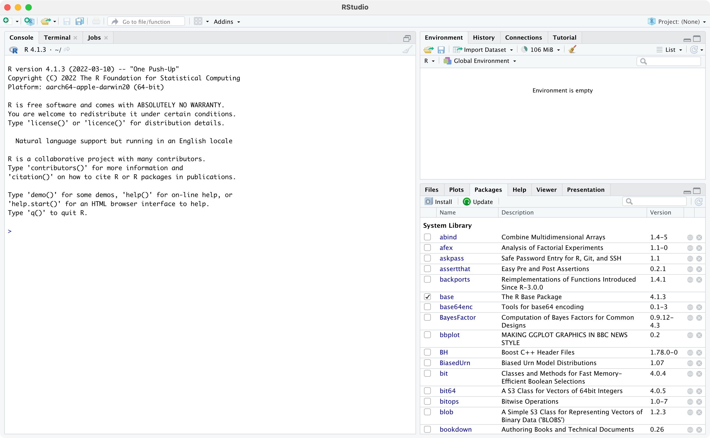

# Introduction to R and RStudio

INCLUDE:

- case sensitive
- how to get help (online, google, etc)
- functions that use (data=, var=) vs functions that use an object (i.e. data$var)
- how to specify a column from a dataframe
- don't give up!

## Learning outcomes  {-}

By the end of this Module, you will be able to:

-   understand the difference between R and RStudio
-   navigate the RStudio interface
-   input and import data into R
-   use R to summarise data
-   perform basic data transformations
-   assign variable and value labels
-   understand the difference between saving R data and saving R output
-   copy R output to a standard word processing package

## Introduction

"R is a language and environment for statistical computing and graphics." [https://www.r-project.org/about.html]. It is an open-source programming language, used mainly for statistics. It is increasingly used in health research, as well as in other fields such as econometrics and social science. The aim of these notes is to introduce the R language within the RStudio environment, and to introduce the commands and procedures that are directly relevant to this course. There is so much more to R than we can cover in these notes. Relevant information will be provided throughout the course, and we will provide further references that you can explore if you are interested.

## R vs RStudio

At its heart, R is a programming language. When you install R on your computer, you are installing the language and its resources, as well as a very basic interface for using R. You can write and run R code using R, but we don't recommend it.

RStudio is an "Integrated Development Environment" that runs R while also providing useful tools to help you as you're writing code and analysing data. Think of R as the engine which does the work, and RStudio as the wrapper which provides a more user-friendly way to interact with R.

## Installing R and RSudio

```{r echo=FALSE, figures-side, fig.show="hold", out.width="80%"}
knitr::include_graphics("img/Rlogo.svg")
knitr::include_graphics("img/RStudio-logo-flat.png")
```

To install R on your computer:

1. Download the R installer:
    a. for Windows:
    b. for MacOS:
2. Install R by running the installer and following the installation instructions. The default settings are fine.
**Note for macOS:** if you are running macOS 10.8 or later, you will need to install an additional application called XQuartz, which is available at https://www.xquartz.org/. Download the latest installer (XQuartz-2.8.1.dmg as of April 2022), and install it in the usual way.
3. Open the R program. You should see a screen as below:

```{r echo=FALSE, fig.show="hold", out.width="80%"}
knitr::include_graphics("img/R-screenshot.png")
```

Near the bottom of the R screen, you will find the ">" symbol which represents the command line. If you type `1 + 2` into the command line and then hit enter you should get:

`[1] 3`

This is R performing your calculation, with the `[1]` indicating that the solution to `1 + 2` is a vector of size 1. We will talk about vectors later.

At this point, close R - we will not interact with R like this in the future. [HOW TO CLOSE R]

To install RStudio on your computer:

1. Make sure you have already installed R, and verified that it is working.
2. Download the RStudio desktop installer at: https://www.rstudio.com/products/rstudio/download. Ensure that you select the RStudio Desktop (Free) installer in the first column.
3. Install RStudio by running the installer and following the installation instructions. The default settings are fine.
4. Open RStudio, which will appear as below:

```{r echo=FALSE, fig.show="hold", out.width="100%"}

```

Locate the command line symbol ">" at the bottom of the left-hand panel. Type `1 + 2` into the command line and hit enter, and you will see:

`[1] 3`

This confirms that RStudio is running correctly, and calling the R language to correctly calculate the sum between 1 and 2!

RStudio currently comprises three window panes, and we will discuss these later.

## A simple R analysis {#simpleR}

In this very brief section, we will introduce R by calculating the average of six ages.

To begin, open a new R Script by choosing **File > New file > R Script **. A script (or a program) is a collection of commands that are sequentially processed by R. You can also type Ctrl+Shift+N in Windows, or Command+Shift+N in MacOS to open a new script in RStudio, or click the **New File** button at the top of the RStudio window.

You should now see four window panes, as below. In the top-left window, type the following (replacing my name with yours, and including today's date):

```{r eval=FALSE}
# Author: Timothy Dobbins
# Date: 5 April 2022
# Purpose: My first R script

age <- c(20, 25, 23, 29, 21, 27)
summary(age)
```

Your screen should look something like:

```{r echo=FALSE, fig.show="hold", out.width="100%"}
knitr::include_graphics("img/RStudio-screenshot-02.png")
```

To run your script, choose **Code > Run Region > Run All**. You will see your code appear in the bottom-right window, with the following output:

```{r eval=FALSE}
> # Author: Timothy Dobbins
> # Date: 5 April 2022
> # Purpose: My first R script
> 
> age <- c(20, 25, 23, 29, 21, 27)

> summary(age)
   Min. 1st Qu.  Median    Mean 3rd Qu.    Max. 
  20.00   21.50   24.00   24.17   26.50   29.00 
```

We will explain the key parts of this script later, but for now, you have entered six ages and calculated the mean age (along with five other summary statistics).

## The RStudio environment

Now that we have seen a simple example of how to use R within RStudio, let's describe the RStudio environment. Let's assume that you have opened a new script editor, and you have four windows as below:

```{r echo=FALSE, fig.show="hold", out.width="100%"}
knitr::include_graphics("img/RStudio-screenshot-03.png")
```

The **Source** window is where you will write and edit your R scripts. The R script can be saved by clicking on File -> Save As or by clicking on the symbol of a floppy disk at the top of the script. The file will have an extension of .R, for example name_of_script.R. Give it a meaningful title and remember to periodically save as you go.

In RStudio, the name of the script will be black when it has been saved, and will change to red if you have any unsaved changes.

The **Console** window, at the bottom left, contains the command line which is indicated with the symbol >. You can type commands here, but anything executed directly from the console is not saved and therefore is lost when the session ends (when you exit RStudio). You should always run your commands from a script file which you can save and use again later. When you run commands from a script, the output and any notes/errors are shown in the console. The Terminal and Jobs tabs will not be used in this course.

The **Environment** window at the top-right shows a list of objects that have been created during your session. When you close your RStudio session these objects will disappear. We will not use the History or Connections tabs in this course.

The bottom right corner contains some useful tabs, in particular the **Help** tab. When you are troubleshooting errors or learning how to use a function, the Help tab should be the first place you visit. Here you can search the help documents for all the packages you have installed. Whenever you create plots in R, these will be shown in the **Plots** tab. The **Packages** tab contains a list of installed packages and indicates which ones are currently in use (we will learn about packages later). Packages which are loaded, i.e. in use, are indicated with a tick. Some packages are in use by default when you begin a new session. You can access information about a package by clicking on its name. The **Files** tab provides a shortcut to access your files. The Viewer tab will not be used in this course.

## Some R basics

While we use R as a statistics package, R is a programming language. In order to use R effectively, we need to define some basics.

### Objects

If you do some reading about R, you may learn that R is an "object-oriented programming language". When we enter or import data into R, we are asking R to create **objects** from our data. These objects can be manipulated and transformed by **functions**, to obtain useful insights from our data.

Objects in R are created using the **assignment operator**. The most common form of the assignment operator looks like an arrow: `<-` and is typed as the `<` and `-` symbols. The simplest way of reading `<-` is as the words "is defined as". Note that it possible to use `->` and even `=` as assignment operators, but their use is less frequent.

Let's see an example:

```{r}
x <- 42
```

This command creates a new object called `x`, which is defined as the number 42 (or in words, "`x` is defined as 42"). Running this command gives no output in the console, but the new object appears in the top-right **Environment** panel. We can view the object in the console by typing its name:

```{r}
# Print the object x
x
```

Now we see the contents of `x` in the console.

This example is rather trivial, and we rarely assign objects of just one value. We'll see a more realistic example soon.

### Data structures

There are two main data structures we will use in the course: **vectors** and **data frames**. A **vector** is a combination of data values, all of the same type. For example, our six ages that we entered earlier is a vector. You could think of a vector as a column of data (even though R prints vectors as rows!) And technically, even an object with only one value is a vector, a vector of size 1.

The easiest way of creating a vector in R is by using the `c()` function, where c stands for 'combine'. In our previous Simple Analysis in R (Section \@ref(simpleR)), we wrote the command:

```{r eval=FALSE}
age <- c(20, 25, 23, 29, 21, 27)
```

This command created a new object called `age`, and *combined* the six values of age into one vector.

Just as having a vector of size 1 is unusual, having just one column of data to analyse is also pretty unusual. The other structure we will describe here is a **data frame** which is essentially a collection of vectors, each of the same size. You could think of a data frame as being like a spreadsheet, with columns representing variables, and rows representing observations.

There are other structures in R, such as matrices and lists, which we won't discuss in this course.

### Functions

If objects are the nouns of R, functions are the verbs. Essentially, functions transform objects. Functions can transform your data into summary statistics, graphical summaries or analysis results. For example, we used the `summary()` function to display summary statistics for our six ages.

R functions are specified by their arguments (or inputs). The arguments that can be supplied for each function can be inspected by examining the help notes for that function. To obtain help for a function, we can submit `help(summary)` (or equivalently `?summary()`) in the console, or we can use the **help** tab in the bottom-right window of RStudio. For example, the first part of the help notes for `summary` appear as:

```{r echo=FALSE, fig.show="hold", out.width="80%"}

```

The help notes in R can be quite cryptic, but **Usage** section details what values should be provided for the function to run. Here, `summary` requires an object to be specified. In our case, we specified `age`, which is our object defined as the vector of six ages.

Most help pages also include some examples of how you might use the function. These can be found at the very bottom of the help page.

```{r echo=FALSE, fig.show="hold", out.width="80%"}
knitr::include_graphics("img/help-2.png")
```

The `summary` function is quite simple, in that it only requires one input, the object to be summarised. More complex functions might require a number of inputs. For example, the help notes for the `descriptives()` function in the `jmv` package show a large number of inputs can be specified:

```{r echo=FALSE, fig.show="hold", out.width="80%"}
knitr::include_graphics("img/help-3.png")
```

There are two things to note here. First, notice that the first two inputs are listed with no = symbol, but all other inputs are listed with = symbols (with values provided after the = symbol). This means that everything apart from `data` and `vars` have **default** values. We are free to not include values for these inputs if we are happy with the defaults provided. For example, by default the variance is not calculated (as `variance = FALSE`). To obtain the variance as well as the standard deviation, we can change this default to `variance = TRUE`:

```{r, eval=FALSE}
# Only the standard deviation is provided as the measure of variability
descriptives(data=pbc, vars=age)

# Additionally request the variance to be calculated
descriptives(data=pbc, vars=age, variance=TRUE)
```

Second, for functions with multiple inputs, we can specify the input name and its value, or we can specify the inputs **in the order listed in the Usage section**. So the following are equivalent:

```{r, eval=FALSE}
# We can specify that the dataset to be summarised is pbc,
#   and the variable to summarise is age:
descriptives(data=pbc, vars=age)

# We can omit the input name, as long as we keep the inputs in the correct order - 
#   that is, dataset first, variable second:
descriptives(pbc, age)

# We can change the order of the inputs, as long as we specify the input name:
descriptives(vars=age, data=pbc)
```

In this course, we will usually provide all the input names, even when they are not required.

### Packages

A **package** is a collection of functions, documentation (and sometimes datasets) that extend the capabilities of R. Packages have been written by R users to be freely distributed and used by others. R packages can be obtained from many sources, but the most common source is CRAN: the Comprehensive R Archive Network.

A useful way of thinking about R is that R is like a smartphone, with packages being like apps which are downloaded from CRAN (similar to an app-store). When you first install R, it comes with a basic set of packages (apps) installed. You can do a lot of things with these basic packages, but sometimes you might want to do things differently (you might prefer Firefox as your browser), or you may want to perform some analyses that can't be done using the default packages. In these cases, you can install a package.

Like installing an app on a smartphone, you only need to _install_ a package once. But each time you want to use the package, you need to _load_ the package into R. This is similar to running the app on your phone. The analogy falls down a bit in that we usually load more than one package in an R script - but we only load the packages we need for that R session.

### How to install a package

There are a couple of ways to install a package. You can use the `install.packages()` function if you know the exact name of the package. Let's use an example of installing the `skimr` package, which gives a very nice, high-level overview of any data frame. We can install `skimr` by typing the following into the console:

```{r, eval=FALSE}
install.packages("skimr")
```

Note the use of the quotation marks.

Alternatively, RStudio offers a graphical way of installing packages that can be accessed via **Tools > Install Packages**, or via the **Install** button at the top of the **Packages** tab in the bottom-right window. You can begin typing the name of the package in the dialog box that appears, and RStudio will use predictive text to offer possible packages:

```{r echo=FALSE, fig.show="hold", out.width="60%"}
knitr::include_graphics("img/install-packages.png")
```

While writing code is usually the recommended way to use R, installing packages is an exception. Using the graphical interface is perfectly fine, because you only need to install a package once.

### How to load a package

When you begin a new session in RStudio, i.e. when you open RStudio, only certain core packages are automatically loaded. You can use the `library()` function to load a package that you has previously been installed. For example, now that we have installed `skimr`, we need to load it before we can use it:

```{r}
library(skimr)
```

Note that quotation marks are not required for the `library()` function (although they can be included if you really like quotation marks!). 

## Part 2: Obtaining basic descriptive statistics

In this exercise, we will analyse data to complete a descriptive table from a research study. The data come from a study in primary biliary cirrhosis, a condition of the liver, from @therneau_grambsch10, Modeling Survival Data: Extending the Cox Model. By the end of this exercise, we will have completed the following table.

```{r echo=FALSE, message=FALSE, warning=FALSE}
library(huxtable)
library(tidyverse)

tab <- tibble::tribble(
                     ~Characteristic,                   ~` `,                    ~Summary,
                       "Age (years)",                     NA, "Mean (SD) or Median [IQR]",
                               "Sex",                 "Male",                     "n (%)",
                               "Sex",               "Female",                     "n (%)",
                       "AST* (U/ml)",                     NA, "Mean (SD) or Median [IQR]",
                   "Serum bilirubin",                     NA, "Mean (SD) or Median [IQR]",
                             "Stage",                    "I",                     "n (%)",
                             "Stage",                   "II",                     "n (%)",
                             "Stage",                  "III",                     "n (%)",
                             "Stage",                 "IIIV",                     "n (%)",
         "Vital status at study end", "Alive: no transplant",                     "n (%)",
         "Vital status at study end",    "Alive: transplant",                     "n (%)",
         "Vital status at study end",             "Deceased",                     "n (%)"
         )

huxtable(tab) %>% 
  theme_article() %>% 
  merge_repeated_rows(everywhere, 1) %>% 
  set_width(0.95) %>% 
  set_caption("Summary of 418 participants from the PBC study (Therneau and Grambsch, 2000)") %>% 
  add_footnote("* asparate aminotransferase")
```
This table is available in Table1.docx, saved on Moodle.

### Opening a data file

Typing data directly into R is not common; we usually open data that have been previously saved. There are two useful packages for importing data into R: `haven` (for data that have been saved by Stata, SAS or SPSS) and `readxl` (for data saved by Microsoft Excel). Additionally, the `labelled` package is useful in working with data that have been labelled in Stata. Here, we will open a dataset that has been stored as a Stata data file (which has the .dta suffix):

1 - If necessary, install the `haven` and `readxl` packages. As mentioned earlier, packages only need to be installed if they have not been installed earlier.

```{r, eval=FALSE}
install.packages("haven")
install.packages("readxl")
```

2 - Locate the data set called pbc.dta on Moodle. Click the file to download it, and then save it in a folder you will be able to locate later - for example, your OneDrive folder. The description of this dataset (i.e. the metadata) have been saved as a plain text file: pbc_info.txt. Locate the file and filepath of pbc.dta.

3 - In R, use the `read_dta()` function to read the Stata data into new object called `pbc`. Remember that we need to load the `haven` and `labelled` packages into R:

```{r}
library(haven)
library(labelled)
library(skimr)

pbc <- read_dta("data/examples/pbc.dta")
```

4 - We now re-assign the pbc object by using the `unlabelled()` function from the `labelled` package:

```{r}
pbc <- unlabelled(pbc)
```

5 - We can now use the `summary()` function or the `skim()` function to examine the pbc dataset.

```{r}
summary(pbc)
skim(pbc)
```

### Summarising continuous variables

One of the most flexible functions for summarising continuous variables is the `descriptives` function from the `jmv` package. The function is specified as `descriptives(data=, vars=)` where:

- `data` specifies the dataframe to be analysed
- `vars` specifies the variable(s) of interest, with multiple variables combined using the `c()` function

We can summarise the three continuous variables in the pbc data: age, AST and serum bilirubin, as shown below.

```{r}
library(jmv)

descriptives(data=pbc, vars=c(age, ast, bili))
```

By default, the `descriptives` function presents the mean, median, standard deviation, minimum and maximum. We can request additional statistics, such as the quartiles (which are called the percentiles, or pc, in the descriptives function):

```{r}
descriptives(data=pbc, vars=c(age, ast, bili), pc=TRUE)
```

### Producing a histogram

We can use the `hist()` function to produce a histogram, specifying the dataframe to use and the variable to be plotted as `dataframe$variable`:

```{r}
hist(pbc$age)
```

The histogram function does a remakarbly good job of choosing cutpoints and binwidths, and these rarely need to be changed. However, the labelling of the histogram should be improved by using `xlab=` and `main=` to assign labels for the x-axis and overall title respectively:

```{r}
hist(pbc$age, xlab="Age (years)", main="Histogram of participant age from pbc study data")
```

### Producing a boxplot

The `boxplot` function is used to produce boxplots, again specifying the dataframe to use and the variable to be plotted as `dataframe$variable`. Labels can be applied in the same way as the histogram:

```{r}
boxplot(pbc$age, xlab="Age (years)", main="Boxplot of participant age from pbc study data")
```

### Producing a one-way frequency table

We have three categorical variables to summarise in Table 1: sex, stage and vital status. These variables are best summarised using one-way frequency tables.

```{r}
library(summarytools)

freq(pbc$sex)
```

## Defning categorical variables as factors

You will notice that the table above, in its current form, is uninterpretable as the 1 and 2 categories are not labelled. In this course, all variables including categorical variables tend to be numerically coded. To define a categorical variable as such in R, we define it as a **factor** using the `factor` function:

`factor(variable=, levels=, labels=)`

We specify:

- `levels`: the values the categorical variable uses can take
- `labels`: the labels corresponding to each of the levels (*entered in the same order as the levels*)

To define our variable sex as a factor, we use:

```{r}
pbc$sex <- factor(pbc$sex, levels=c(1, 2), labels=c("Male", "Female"))
```

We can confirm the coding by re-running a frequency table:

```{r}
freq(pbc$sex)
```

Task: define Stage and Vital Status as factors, and produce one-way frequency tables.

### Copying output from R [UPDATE]

It is important to note that saving data in Stata will not save your output. Stata data and output are completely separate to one another. The easiest way to retain the output of your analyses is to copy the output into a word processor package (e.g. Microsoft Word) before closing Stata. Once Stata is closed, all the output (that is, all your hard work!) is lost.

To copy output from Stata, you can select the output and choose Edit \> Copy. This will copy the output as plain text for pasting into a Word document. As this is a table, you can also Copy table or Copy table as HTML. For this course, we recommend that you Copy table as HTML for pasting into Word. Whichever way you do it, you will need to make sure you reformat the table and relabel your header row and column properly for your assignments as described in Module 1. Alternatively, you can copy with the Copy table option for pasting into an Excel worksheet and reformat your table in Excel before pasting into Word.

Copying output from Stata can get a little complicated to explain. We have included a video on Moodle to summarise the different ways output can be copied.

Task: complete Table 1 using the output generated in this exercise. You should decide on whether to present continuous variables by their means or medians, and present the most appropriate measure of spread. Include footnotes to indicate if any variables contain missing observations.

## Part 3: Creating other types of graphs {-}

### Bar graphs

Here we will create the bar chart shown in Figure 1.1 using the `pbc.dta` dataset. The x-axis of this graph will be the stage of disease, and the y-axis will show the number of participants in each category.

#### Simple bar graph
For most of our bar graphs, we will be plotting frequencies, so we choose **Graph of frequencies within categories**

```{r}
# Convert stage into a factpr
pbc$stage <- factor(pbc$stage, levels=c(1,2,3,4), labels=c("Stage 1", "Stage 2", "Stage 3", "Stage 4"))

plot(pbc$stage, main="Bar graph of stage of disease from PBC study", ylab="Number of participants")
```

### Clustered bar graph

To create a clustered bar chart as shown in Figure 1.2:

```{r}
counts <- table(pbc$sex, pbc$stage)
barplot(counts, main="Bar graph of stage of disease by sex from PBC study",
        legend = rownames(counts), beside=TRUE, args.legend = list(x = "topleft"))
```


### Stacked bar graph
To create a stacked bar chart shown in Figure 1.4, bring up the **Bar chart** dialog box, go to the **Options** tab and tick **Stack bars on y variables**.

```{r}
barplot(counts, main="Bar graph of stage of disease by sex from PBC study",
        legend = rownames(counts), beside=FALSE, args.legend = list(x = "topleft"))
```

### Stacked bar graph of relative frequencies

If one wants to compare the sex distribution across the stage categories, it would be convenient if all the bars have the same height (100%). To generate such a bar chart in Stata, tick **Base bar heights on percentages** in the **Options** tab of the **Bar charts** dialog box. Change the y-axis title in the **Y axis** tab to `Percentage of students in each age group`.

```{r}
percent <- prop.table(counts, margin=2)*100
percent

barplot(percent, main="Relative frequency of sex within stage of disease from PBC study",
        legend = rownames(counts), beside=FALSE, args.legend = list(x = "topright"))

```


### Creating line graphs
To demonstrate the graphing of aggregate data with Stata, we use the data on new cases and deaths from prostate cancer in males in NSW. This data has been entered into Stata as `Example_1.2.dta`.

```{r}
cancer <- read_stata("data/examples/Example_1.2.dta")
skim(cancer)

plot(cancer$year, cancer$rcases, type="l", col = "red", xlab = "Year", ylab = "Age-standardised rate (per 100,000)")

# Change scale
plot(cancer$year, cancer$rcases, type="l", col = "red", xlab = "Year", ylab = "Age-standardised rate (per 100,000)", ylim=c(0,200))

# Add a second line
lines(cancer$year, cancer$rdeaths, col = "blue", type = "l", lty = 2)

# Add a legend to the plot
legend("topleft", legend=c("Incidence", "Deaths"),
       col=c("red", "blue"), lty = 1:2)

```


### Line graph

