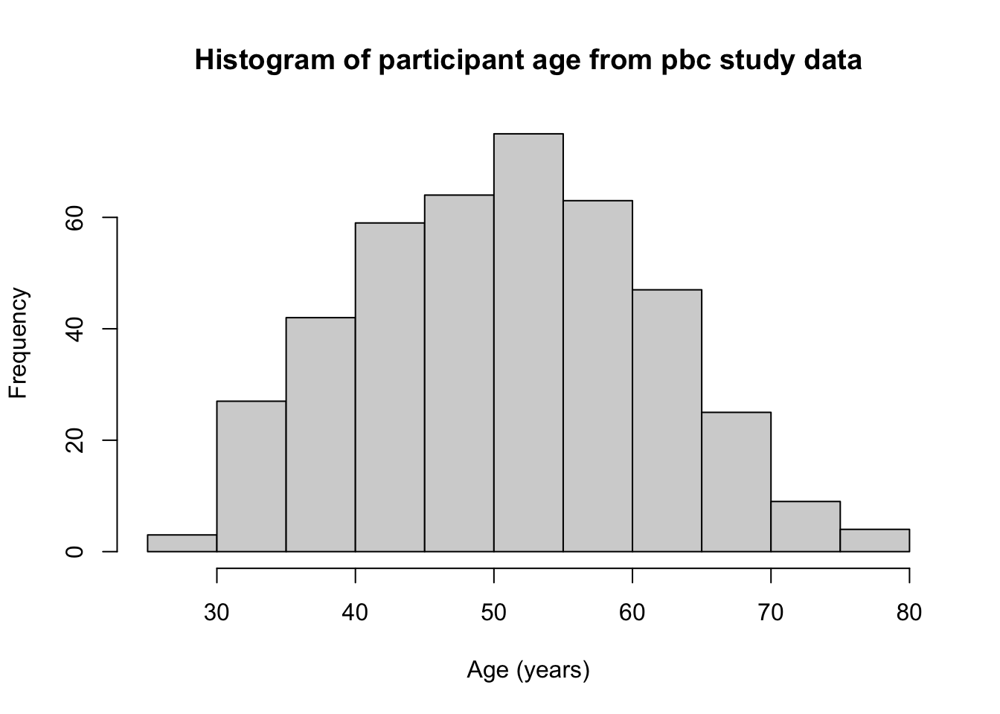
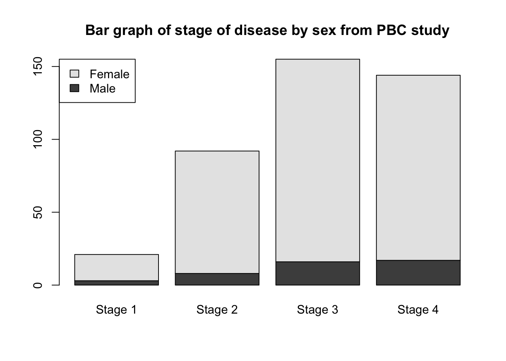

# Introduction to R and RStudio

## Learning outcomes  {-}

By the end of this Module, you will be able to:

-   understand the difference between R and RStudio
-   navigate the RStudio interface
-   input and import data into R
-   use R to summarise data
-   perform basic data transformations
-   assign variable and value labels
-   understand the difference between saving R data and saving R output
-   copy R output to a standard word processing package

## Introduction

"R is a language and environment for statistical computing and graphics." [ref to https://www.r-project.org/about.html]. It is an open-source programming language, used mainly for statistics. It is increasingly used in health research, as well as in other fields such as econometrics and social science. The aim of these notes is to introduce the R language within the RStudio environment, and to introduce the commands and procedures that are directly relevant to this course. There is so much more to R than we can cover in these notes. Relevant information will be provided throughout the course, and we will provide further references that you can explore if you are interested.

## R vs RStudio

At its heart, R is a programming language. When you install R on your computer, you are installing the language and its resources, as well as a very basic interface for using R. You can write and run R code using R, but we don't recommend it.

RStudio is an "Integrated Development Environment" that runs R while also providing useful tools to help you as you're writing code and analysing data. Think of R as the engine which does the work, and RStudio as the wrapper which provides a more user-friendly way to interact with R.

## Installing R and RSudio


```r
par(mar = c(4, 4, .1, .1))
knitr::include_graphics(here::here("img", "Rlogo.svg"))
#> Warning in knitr::include_graphics(here::here("img",
#> "Rlogo.svg")): It is highly recommended to use relative
#> paths for images. You had absolute paths: "/Users/td/
#> Documents/GithubRepos/PHCM9795-R/img/Rlogo.svg"
knitr::include_graphics(here::here("img", "RStudio-logo-flat.png"))
#> Warning in knitr::include_graphics(here::here("img",
#> "RStudio-logo-flat.png")): It is highly recommended to
#> use relative paths for images. You had absolute paths: "/
#> Users/td/Documents/GithubRepos/PHCM9795-R/img/RStudio-logo-
#> flat.png"
```


To install R on your computer:

1. Download the R installer:
    a. for Windows:
    b. for MacOS:
2. Install R by running the installer and following the installation instructions. Note, the default settings are fine.
3. Open the R program. You should see a screen as below:

**Note for macOS:** if you are running macOS 10.8 or later, you will need to install an additional application called XQuartz, which is available at https://www.xquartz.org/. Download the latest installer (XQuartz-2.8.1.dmg as of April 2022), and install it in the usual way.

At the end of the text you will find the ">" symbol which represents the command line. If you type `1 + 2` into the command line and then hit enter you should get:

`## [1] 3`

At this point, close R - we will not interact with R like this in the future.

To install RStudio on your computer:

1. Make sure you have already installed R, and verified that it is working.
2. Download the RStudio desktop installer at: https://www.rstudio.com/products/rstudio/download. Ensure that you select the RStudio Desktop (Free) installer in the first column.
3. Install RStudio by running the installer and following the installation instructions. Note, the default settings are fine.
4. Open RStudio, which will appear as below:

Locate the command line symbol ">" at the bottom of the left-hand panel. Type `1 + 2` into the command line and hit enter, and you will see:

`## [1] 3`

This confirms that RStudio is running correctly, and calling the R language to correctly calculate the sum between 1 and 2!

RStudio currently comprises three window panes, and we will discuss these later.

## A simple R analysis

In this very brief section, we will introduce R by calculating the average of six ages.

To begin, open a new R Script by choosing **File > New file > R Script **. A script (or a program) is a collection of commands that are sequentially processed by R. You can also type Ctrl+Shift+N in Windows, or Command+Shift+N in MacOS to open a new script in RStudio, or click the **New File** button at the top of the RStudio window.

You should now see four window panes, as below. In the top-left window, type the following (replacing my name with yours, and including today's date:


```r
# Author: Timothy Dobbins
# Date: 5 April 2022
# Purpose: My first R script

age <- c(20, 25, 23, 29, 21, 27)
summary(age)
```

To run your script, choose **Code > Run Region > Run All**. You will see your code appear in the bottom-right window, with the following output:


```r
> # Author: Timothy Dobbins
> # Date: 5 April 2022
> # Purpose: My first R script
> 
> age <- c(20, 25, 23, 29, 21, 27)

> summary(age)
   Min. 1st Qu.  Median    Mean 3rd Qu.    Max. 
  20.00   21.50   24.00   24.17   26.50   29.00 
```

We will explain the key parts of this script later, but for now, you have entered six ages and calculated the mean age (along with five other summary statistics).

## The RStudio environment

Now that we have seen a simple example of how to use R within RStudio, let's describe the RStudio environment. Let's assume that you have opened a new script editor, and you have four windows as below.

The **Script** window is where you will write and edit your R scripts. The R script can be saved by clicking on File -> Save As or by clicking on the symbol of a floppy disk at the top of the script. The file will have an extension of .R, for example name_of_script.R. Give it a meaningful title and remember to periodically save as you go.

In RStudio, the name of the script will be black when it has been saved, and will change to red if you have any unsaved changes.

The **Console** window, at the bottom right, contains the command line which is indicated with the symbol >. You can type commands here, but anything executed directly from the console is not saved and therefore is lost when the session ends (when you exit RStudio). You should always run your commands from a script file which you can save and use again later. When you run commands from a script, the output and any notes/errors are shown in the console. The Terminal and Jobs tabs will not be used in this course.

The **Environment** window at the top-right shows a list of objects that have been created during your session. When you close your RStudio session these objects will disappear. We will not use the History or Connections tabs in this course.

The bottom right corner contains some useful tabs, in particular the **Help** tab. When you are troubleshooting errors or learning how to use a function, the Help tab should be the first place you visit. Here you can search the help documents for all the packages you have installed. Whenever you create plots in R, these will be shown in the **Plots** tab. The **Packages** tab contains a list of installed packages and indicates which ones are currently in use (we will learn about packages later). Packages which are loaded, i.e. in use, are indicated with a tick. Some packages are in use by default when you begin a new session. You can access information about a package by clicking on its name. The **Files** tab provides a shortcut to access your files. The Viewer tab will not be used in this course.

## Some R basics

### Data types
- vectors
- data frames
- [matrix, list]

### Objects

Assigning

### Functions

### Packages

### Many ways to do one thing - embrace inconsistency

## Part 2: Obtaining basic descriptive statistics

In this exercise, we will analyse data to complete a descriptive table from a research study. The data come from a study in primary biliary cirrhosis, a condition of the liver, from @therneau_grambsch10, Modeling Survival Data: Extending the Cox Model. By the end of this exercise, we will have completed the following table.


```
#> ── Attaching packages ─────────────────── tidyverse 1.3.1 ──
#> ✓ ggplot2 3.3.5     ✓ purrr   0.3.4
#> ✓ tibble  3.1.6     ✓ dplyr   1.0.8
#> ✓ tidyr   1.2.0     ✓ stringr 1.4.0
#> ✓ readr   2.1.2     ✓ forcats 0.5.1
#> ── Conflicts ────────────────────── tidyverse_conflicts() ──
#> x dplyr::add_rownames() masks huxtable::add_rownames()
#> x dplyr::filter()       masks stats::filter()
#> x dplyr::lag()          masks stats::lag()
#> x ggplot2::theme_grey() masks huxtable::theme_grey()
```

<!--html_preserve--><table class="huxtable" style="border-collapse: collapse; border: 0px; margin-bottom: 2em; margin-top: 2em; width: 95%; margin-left: auto; margin-right: auto;  " id="tab:unnamed-chunk-3">
<caption style="caption-side: top; text-align: center;">(#tab:unnamed-chunk-3) Summary of 418 participants from the PBC study (Therneau and Grambsch, 2000)</caption><col><col><col><tr>
<th style="vertical-align: top; text-align: left; white-space: normal; border-style: solid solid solid solid; border-width: 0.4pt 0pt 0.4pt 0pt;    padding: 6pt 6pt 6pt 0pt; font-weight: bold;">Characteristic</th><th style="vertical-align: top; text-align: left; white-space: normal; border-style: solid solid solid solid; border-width: 0.4pt 0pt 0.4pt 0pt;    padding: 6pt 6pt 6pt 6pt; font-weight: bold;"> </th><th style="vertical-align: top; text-align: left; white-space: normal; border-style: solid solid solid solid; border-width: 0.4pt 0pt 0.4pt 0pt;    padding: 6pt 0pt 6pt 6pt; font-weight: bold;">Summary</th></tr>
<tr>
<td style="vertical-align: top; text-align: left; white-space: normal; border-style: solid solid solid solid; border-width: 0.4pt 0pt 0pt 0pt;    padding: 6pt 6pt 6pt 0pt; font-weight: normal;">Age (years)</td><td style="vertical-align: top; text-align: left; white-space: normal; border-style: solid solid solid solid; border-width: 0.4pt 0pt 0pt 0pt;    padding: 6pt 6pt 6pt 6pt; font-weight: normal;"></td><td style="vertical-align: top; text-align: left; white-space: normal; border-style: solid solid solid solid; border-width: 0.4pt 0pt 0pt 0pt;    padding: 6pt 0pt 6pt 6pt; font-weight: normal;">Mean (SD) or Median [IQR]</td></tr>
<tr>
<td rowspan="2" style="vertical-align: top; text-align: left; white-space: normal; padding: 6pt 6pt 6pt 0pt; font-weight: normal;">Sex</td><td style="vertical-align: top; text-align: left; white-space: normal; padding: 6pt 6pt 6pt 6pt; font-weight: normal;">Male</td><td style="vertical-align: top; text-align: left; white-space: normal; padding: 6pt 0pt 6pt 6pt; font-weight: normal;">n (%)</td></tr>
<tr>
<td style="vertical-align: top; text-align: left; white-space: normal; padding: 6pt 6pt 6pt 6pt; font-weight: normal;">Female</td><td style="vertical-align: top; text-align: left; white-space: normal; padding: 6pt 0pt 6pt 6pt; font-weight: normal;">n (%)</td></tr>
<tr>
<td style="vertical-align: top; text-align: left; white-space: normal; padding: 6pt 6pt 6pt 0pt; font-weight: normal;">AST* (U/ml)</td><td style="vertical-align: top; text-align: left; white-space: normal; padding: 6pt 6pt 6pt 6pt; font-weight: normal;"></td><td style="vertical-align: top; text-align: left; white-space: normal; padding: 6pt 0pt 6pt 6pt; font-weight: normal;">Mean (SD) or Median [IQR]</td></tr>
<tr>
<td style="vertical-align: top; text-align: left; white-space: normal; padding: 6pt 6pt 6pt 0pt; font-weight: normal;">Serum bilirubin</td><td style="vertical-align: top; text-align: left; white-space: normal; padding: 6pt 6pt 6pt 6pt; font-weight: normal;"></td><td style="vertical-align: top; text-align: left; white-space: normal; padding: 6pt 0pt 6pt 6pt; font-weight: normal;">Mean (SD) or Median [IQR]</td></tr>
<tr>
<td rowspan="4" style="vertical-align: top; text-align: left; white-space: normal; padding: 6pt 6pt 6pt 0pt; font-weight: normal;">Stage</td><td style="vertical-align: top; text-align: left; white-space: normal; padding: 6pt 6pt 6pt 6pt; font-weight: normal;">I</td><td style="vertical-align: top; text-align: left; white-space: normal; padding: 6pt 0pt 6pt 6pt; font-weight: normal;">n (%)</td></tr>
<tr>
<td style="vertical-align: top; text-align: left; white-space: normal; padding: 6pt 6pt 6pt 6pt; font-weight: normal;">II</td><td style="vertical-align: top; text-align: left; white-space: normal; padding: 6pt 0pt 6pt 6pt; font-weight: normal;">n (%)</td></tr>
<tr>
<td style="vertical-align: top; text-align: left; white-space: normal; padding: 6pt 6pt 6pt 6pt; font-weight: normal;">III</td><td style="vertical-align: top; text-align: left; white-space: normal; padding: 6pt 0pt 6pt 6pt; font-weight: normal;">n (%)</td></tr>
<tr>
<td style="vertical-align: top; text-align: left; white-space: normal; padding: 6pt 6pt 6pt 6pt; font-weight: normal;">IIIV</td><td style="vertical-align: top; text-align: left; white-space: normal; padding: 6pt 0pt 6pt 6pt; font-weight: normal;">n (%)</td></tr>
<tr>
<td rowspan="3" style="vertical-align: top; text-align: left; white-space: normal; border-style: solid solid solid solid; border-width: 0pt 0pt 0.8pt 0pt;    padding: 6pt 6pt 6pt 0pt; font-weight: normal;">Vital status at study end</td><td style="vertical-align: top; text-align: left; white-space: normal; padding: 6pt 6pt 6pt 6pt; font-weight: normal;">Alive: no transplant</td><td style="vertical-align: top; text-align: left; white-space: normal; padding: 6pt 0pt 6pt 6pt; font-weight: normal;">n (%)</td></tr>
<tr>
<td style="vertical-align: top; text-align: left; white-space: normal; padding: 6pt 6pt 6pt 6pt; font-weight: normal;">Alive: transplant</td><td style="vertical-align: top; text-align: left; white-space: normal; padding: 6pt 0pt 6pt 6pt; font-weight: normal;">n (%)</td></tr>
<tr>
<td style="vertical-align: top; text-align: left; white-space: normal; border-style: solid solid solid solid; border-width: 0pt 0pt 0.8pt 0pt;    padding: 6pt 6pt 6pt 6pt; font-weight: normal;">Deceased</td><td style="vertical-align: top; text-align: left; white-space: normal; border-style: solid solid solid solid; border-width: 0pt 0pt 0.8pt 0pt;    padding: 6pt 0pt 6pt 6pt; font-weight: normal;">n (%)</td></tr>
<tr>
<td colspan="3" style="vertical-align: top; text-align: left; white-space: normal; border-style: solid solid solid solid; border-width: 0.8pt 0pt 0pt 0pt;    padding: 6pt 6pt 6pt 6pt; font-weight: normal;">* asparate aminotransferase</td></tr>
</table>
<!--/html_preserve-->
This table is available in Table1.docx, saved on Moodle.

### Opening a data file

Typing data directly into R is not common; we usually open data that have been saved as a Stata data file, or import data that have been entered into another package. Here, we will open a dataset that has been stored as a Stata data file (which has the .dta suffix).

Step 1: Locate the data set called pbc.dta on Moodle. Click the file to download it, and then save it in a folder you will be able to locate later - for example, your OneDrive folder. The description of this dataset (i.e. the metadata) have been saved as a plain text file: pbc_info.txt

Step 2: In Stata, choose File ▶︎ Open. Browse to where you stored the dataset and click Open.

Step 3: You may get an error: "Data in memory have changed". This means that you have not saved a copy of your current data, and by importing a new dataset, your changes will be lost. As Stata can only open one set of data at a time, you can choose to: Save your current data, Don't Save your current data, or Cancel. We don't need to save the data from our simple analysis (the six ages), so we can choose Don't Save.

After opening the data successfully, there will be 418 rows of data, and 20 variables. Examine the pbc_info.txt file for a description of each variable.


```r
library(haven)
library(labelled)
library(skimr)

pbc <- read_dta("data/examples/pbc.dta") %>% 
  unlabelled()

skim(pbc)
```


Table: (\#tab:unnamed-chunk-4)Data summary

|                         |     |
|:------------------------|:----|
|Name                     |pbc  |
|Number of rows           |418  |
|Number of columns        |20   |
|_______________________  |     |
|Column type frequency:   |     |
|numeric                  |20   |
|________________________ |     |
|Group variables          |None |


**Variable type: numeric**

|skim_variable | n_missing| complete_rate|    mean|      sd|     p0|     p25|     p50|     p75|     p100|hist  |
|:-------------|---------:|-------------:|-------:|-------:|------:|-------:|-------:|-------:|--------:|:-----|
|id            |         0|          1.00|  209.50|  120.81|   1.00|  105.25|  209.50|  313.75|   418.00|▇▇▇▇▇ |
|time          |         0|          1.00| 1917.78| 1104.67|  41.00| 1092.75| 1730.00| 2613.50|  4795.00|▅▇▆▃▂ |
|status        |         0|          1.00|    0.83|    0.96|   0.00|    0.00|    0.00|    2.00|     2.00|▇▁▁▁▆ |
|trt           |       106|          0.75|    1.49|    0.50|   1.00|    1.00|    1.00|    2.00|     2.00|▇▁▁▁▇ |
|age           |         0|          1.00|   50.74|   10.45|  26.28|   42.83|   51.00|   58.24|    78.44|▂▆▇▅▁ |
|sex           |         0|          1.00|    1.89|    0.31|   1.00|    2.00|    2.00|    2.00|     2.00|▁▁▁▁▇ |
|ascites       |       106|          0.75|    0.08|    0.27|   0.00|    0.00|    0.00|    0.00|     1.00|▇▁▁▁▁ |
|hepato        |       106|          0.75|    0.51|    0.50|   0.00|    0.00|    1.00|    1.00|     1.00|▇▁▁▁▇ |
|spiders       |       106|          0.75|    0.29|    0.45|   0.00|    0.00|    0.00|    1.00|     1.00|▇▁▁▁▃ |
|edema         |         0|          1.00|    0.10|    0.25|   0.00|    0.00|    0.00|    0.00|     1.00|▇▁▁▁▁ |
|bili          |         0|          1.00|    3.22|    4.41|   0.30|    0.80|    1.40|    3.40|    28.00|▇▁▁▁▁ |
|chol          |       134|          0.68|  369.51|  231.94| 120.00|  249.50|  309.50|  400.00|  1775.00|▇▁▁▁▁ |
|albumin       |         0|          1.00|    3.50|    0.42|   1.96|    3.24|    3.53|    3.77|     4.64|▁▂▇▇▁ |
|copper        |       108|          0.74|   97.65|   85.61|   4.00|   41.25|   73.00|  123.00|   588.00|▇▂▁▁▁ |
|alkphos       |       106|          0.75| 1982.66| 2140.39| 289.00|  871.50| 1259.00| 1980.00| 13862.40|▇▁▁▁▁ |
|ast           |       106|          0.75|  122.56|   56.70|  26.35|   80.60|  114.70|  151.90|   457.25|▇▇▁▁▁ |
|trig          |       136|          0.67|  124.70|   65.15|  33.00|   84.25|  108.00|  151.00|   598.00|▇▂▁▁▁ |
|platelet      |        11|          0.97|  257.02|   98.33|  62.00|  188.50|  251.00|  318.00|   721.00|▅▇▃▁▁ |
|protime       |         2|          1.00|   10.73|    1.02|   9.00|   10.00|   10.60|   11.10|    18.00|▇▅▁▁▁ |
|stage         |         6|          0.99|    3.02|    0.88|   1.00|    2.00|    3.00|    4.00|     4.00|▁▅▁▇▇ |


### Summarising continuous variables

One of the most flexible functions for summarising continuous variables is the `descriptives` function from the `jmv` package. The function is specified as `descriptives(data=, vars=)` where:

- `data` specifies the dataframe to be analysed
- `vars` specifies the variable(s) of interest, with multiple variables combined using the `c()` function

We can summarise the three continuous variables in the pbc data: age, AST and serum bilirubin, as shown below.


```r
library(jmv)

descriptives(data=pbc, vars=c(age, ast, bili))
#> 
#>  DESCRIPTIVES
#> 
#>  Descriptives                                                
#>  ─────────────────────────────────────────────────────────── 
#>                          age         ast         bili        
#>  ─────────────────────────────────────────────────────────── 
#>    N                          418         312          418   
#>    Missing                      0         106            0   
#>    Mean                  50.74155    122.5563     3.220813   
#>    Median                51.00068    114.7000     1.400000   
#>    Standard deviation    10.44721    56.69952     4.407506   
#>    Minimum               26.27789    26.35000    0.3000000   
#>    Maximum               78.43943    457.2500     28.00000   
#>  ───────────────────────────────────────────────────────────
```

By default, the `descriptives` function presents the mean, median, standard deviation, minimum and maximum. We can request additional statistics, such as the quartiles [ADD MORE HERE]:


```r
descriptives(data=pbc, vars=c(age, ast, bili), pc=TRUE)
#> 
#>  DESCRIPTIVES
#> 
#>  Descriptives                                                
#>  ─────────────────────────────────────────────────────────── 
#>                          age         ast         bili        
#>  ─────────────────────────────────────────────────────────── 
#>    N                          418         312          418   
#>    Missing                      0         106            0   
#>    Mean                  50.74155    122.5563     3.220813   
#>    Median                51.00068    114.7000     1.400000   
#>    Standard deviation    10.44721    56.69952     4.407506   
#>    Minimum               26.27789    26.35000    0.3000000   
#>    Maximum               78.43943    457.2500     28.00000   
#>    25th percentile       42.83231    80.60000    0.8000000   
#>    50th percentile       51.00068    114.7000     1.400000   
#>    75th percentile       58.24093    151.9000     3.400000   
#>  ───────────────────────────────────────────────────────────
```

### Producing a histogram

We can use the `hist` function to produce a histogram, specifying the dataframe to use and the variable to be plotted as `dataframe$variable`:


```r
hist(pbc$age)
```


The histogram function does a remakarbly good job of choosing cutpoints and binwidths, and these rarely need to be changed. However, the labelling of the histogram should be improved by using `xlab=` and `main=` to assign labels for the x-axis and overall title respectively:


```r
hist(pbc$age, xlab="Age (years)", main="Histogram of participant age from pbc study data")
```



### Producing a boxplot

The `boxplot` function is used to produce boxplots, again specifying the dataframe to use and the variable to be plotted as `dataframe$variable`. Labels can be applied in the same way as the histogram:


```r
boxplot(pbc$age, xlab="Age (years)", main="Boxplot of participant age from pbc study data")
```


### Producing a one-way frequency table

We have three categorical variables to summarise in Table 1: sex, stage and vital status. These variables are best summarised using one-way frequency tables.


```r
library(summarytools)
#> 
#> Attaching package: 'summarytools'
#> The following object is masked from 'package:tibble':
#> 
#>     view
#> The following objects are masked from 'package:huxtable':
#> 
#>     label, label<-

freq(pbc$sex)
#> Frequencies  
#> pbc$sex  
#> Type: Numeric  
#> 
#>               Freq   % Valid   % Valid Cum.   % Total   % Total Cum.
#> ----------- ------ --------- -------------- --------- --------------
#>           1     44     10.53          10.53     10.53          10.53
#>           2    374     89.47         100.00     89.47         100.00
#>        <NA>      0                               0.00         100.00
#>       Total    418    100.00         100.00    100.00         100.00
```

## Defning categorical variables as factors

You will notice that the table above, in its current form, is uninterpretable as the 1 and 2 categories are not labelled. In this course, all variables including categorical variables tend to be numerically coded. To define a categorical variable as such in R, we define it as a **factor** using the `factor` function:

`factor(variable=, levels=, labels=)`

We specify:

- `levels`: the values the categorical variable uses can take
- `labels`: the labels corresponding to each of the levels (*entered in the same order as the levels*)

To define our variable sex as a factor, we use:


```r
pbc$sex <- factor(pbc$sex, levels=c(1, 2), labels=c("Male", "Female"))
```

We can confirm the coding by re-running a frequency table:


```r
freq(pbc$sex)
#> Frequencies  
#> pbc$sex  
#> Type: Factor  
#> 
#>                Freq   % Valid   % Valid Cum.   % Total   % Total Cum.
#> ------------ ------ --------- -------------- --------- --------------
#>         Male     44     10.53          10.53     10.53          10.53
#>       Female    374     89.47         100.00     89.47         100.00
#>         <NA>      0                               0.00         100.00
#>        Total    418    100.00         100.00    100.00         100.00
```

Task: define Stage and Vital Status as factors, and produce one-way frequency tables.

Saving data from Stata

Now that you have made some changes to the pbc data, it is good practice to save the dataset. Stata uses its own file format to save data. Data saved from Stata will end with the .dta suffix, and will contain useful information such as variable labels, value labels. However, data saved by Stata will only be able to be opened by Stata - you will not easily be able to share your data with colleagues who do not have Stata. To save a Stata dataset, choose File ▶︎ Save.

Copying output from Stata

It is important to note that saving data in Stata will not save your output. Stata data and output are completely separate to one another. The easiest way to retain the output of your analyses is to copy the output into a word processor package (e.g. Microsoft Word) before closing Stata. Once Stata is closed, all the output (that is, all your hard work!) is lost.

To copy output from Stata, you can select the output and choose Edit \> Copy. This will copy the output as plain text for pasting into a Word document. As this is a table, you can also Copy table or Copy table as HTML. For this course, we recommend that you Copy table as HTML for pasting into Word. Whichever way you do it, you will need to make sure you reformat the table and relabel your header row and column properly for your assignments as described in Module 1. Alternatively, you can copy with the Copy table option for pasting into an Excel worksheet and reformat your table in Excel before pasting into Word.

Copying output from Stata can get a little complicated to explain. We have included a video on Moodle to summarise the different ways output can be copied.

Task: complete Table 1 using the output generated in this exercise. You should decide on whether to present continuous variables by their means or medians, and present the most appropriate measure of spread. Include footnotes to indicate if any variables contain missing observations.

## Part 3: Creating other types of graphs {-}

### Bar graphs

Here we will create the bar chart shown in Figure 1.1 using the `pbc.dta` dataset. The x-axis of this graph will be the stage of disease, and the y-axis will show the number of participants in each category.

#### Simple bar graph
For most of our bar graphs, we will be plotting frequencies, so we choose **Graph of frequencies within categories**


```r
# Convert stage into a factpr
pbc$stage <- factor(pbc$stage, levels=c(1,2,3,4), labels=c("Stage 1", "Stage 2", "Stage 3", "Stage 4"))

plot(pbc$stage, main="Bar graph of stage of disease from PBC study", ylab="Number of participants")
```


### Clustered bar graph

To create a clustered bar chart as shown in Figure 1.2:


```r
counts <- table(pbc$sex, pbc$stage)
barplot(counts, main="Bar graph of stage of disease by sex from PBC study",
        legend = rownames(counts), beside=TRUE, args.legend = list(x = "topleft"))
```


### Stacked bar graph
To create a stacked bar chart shown in Figure 1.4, bring up the **Bar chart** dialog box, go to the **Options** tab and tick **Stack bars on y variables**.


```r
barplot(counts, main="Bar graph of stage of disease by sex from PBC study",
        legend = rownames(counts), beside=FALSE, args.legend = list(x = "topleft"))
```



### Stacked bar graph of relative frequencies

If one wants to compare the sex distribution across the stage categories, it would be convenient if all the bars have the same height (100%). To generate such a bar chart in Stata, tick **Base bar heights on percentages** in the **Options** tab of the **Bar charts** dialog box. Change the y-axis title in the **Y axis** tab to `Percentage of students in each age group`.


```r
percent <- prop.table(counts, margin=2)*100
percent
#>         
#>            Stage 1   Stage 2   Stage 3   Stage 4
#>   Male   14.285714  8.695652 10.322581 11.805556
#>   Female 85.714286 91.304348 89.677419 88.194444

barplot(percent, main="Relative frequency of sex within stage of disease from PBC study",
        legend = rownames(counts), beside=FALSE, args.legend = list(x = "topright"))
```


### Creating line graphs
To demonstrate the graphing of aggregate data with Stata, we use the data on new cases and deaths from prostate cancer in males in NSW. This data has been entered into Stata as `Example_1.2.dta`.


```r
cancer <- read_stata("data/examples/Example_1.2.dta")
skim(cancer)
```


Table: (\#tab:unnamed-chunk-17)Data summary

|                         |       |
|:------------------------|:------|
|Name                     |cancer |
|Number of rows           |20     |
|Number of columns        |5      |
|_______________________  |       |
|Column type frequency:   |       |
|numeric                  |5      |
|________________________ |       |
|Group variables          |None   |


**Variable type: numeric**

|skim_variable | n_missing| complete_rate|    mean|      sd|     p0|     p25|     p50|     p75|   p100|hist  |
|:-------------|---------:|-------------:|-------:|-------:|------:|-------:|-------:|-------:|------:|:-----|
|year          |         0|             1| 1996.50|    5.92| 1987.0| 1991.75| 1996.50| 2001.25| 2006.0|▇▇▇▇▇ |
|ncases        |         0|             1| 3719.35| 1338.61| 1567.0| 2804.50| 3789.50| 4402.75| 6158.0|▅▁▇▂▂ |
|ndeaths       |         0|             1|  854.95|  105.60|  645.0|  788.25|  868.00|  921.00| 1044.0|▂▅▇▇▃ |
|rcases        |         0|             1|  135.44|   31.34|   81.8|  121.92|  131.30|  164.20|  186.9|▃▁▇▂▅ |
|rdeaths       |         0|             1|   37.09|    3.82|   31.1|   34.67|   36.55|   40.38|   43.8|▆▇▅▇▅ |

```r

plot(cancer$year, cancer$rcases, type="l", col = "red", xlab = "Year", ylab = "Age-standardised rate (per 100,000)")
```


```r

# Change scale
plot(cancer$year, cancer$rcases, type="l", col = "red", xlab = "Year", ylab = "Age-standardised rate (per 100,000)", ylim=c(0,200))

# Add a second line
lines(cancer$year, cancer$rdeaths, col = "blue", type = "l", lty = 2)

# Add a legend to the plot
legend("topleft", legend=c("Incidence", "Deaths"),
       col=c("red", "blue"), lty = 1:2)
```


### Line graph
