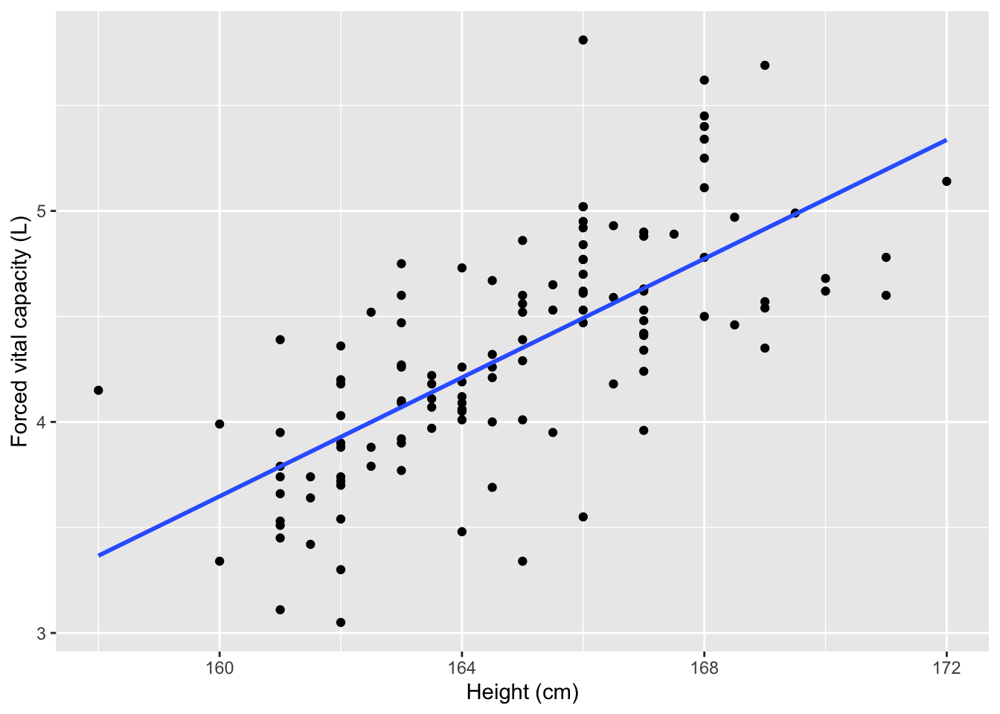
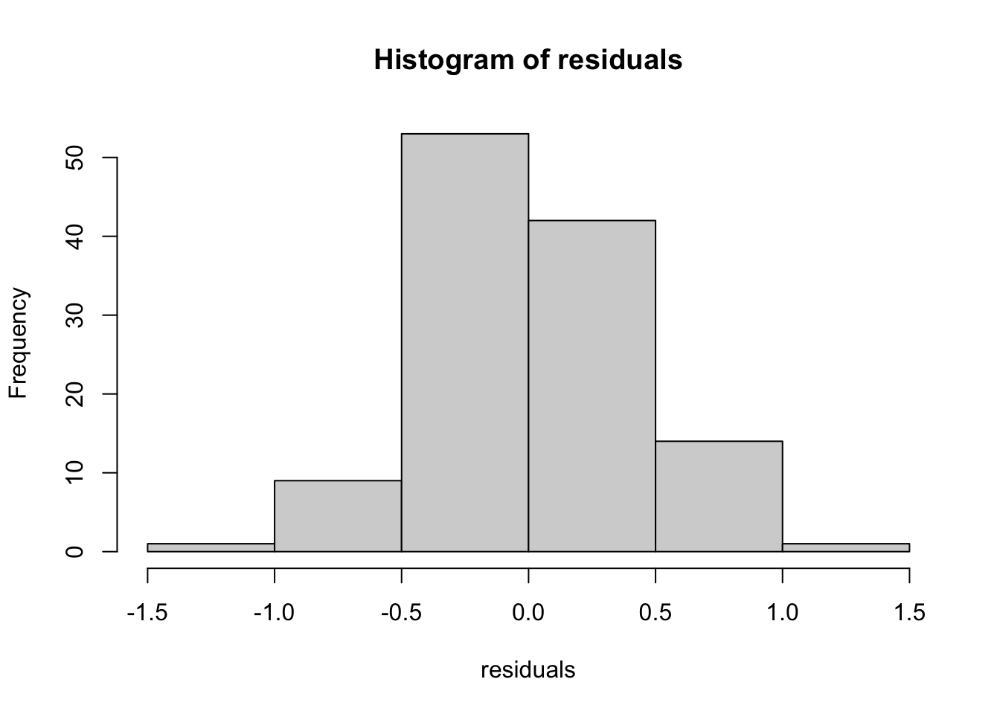

---
output:
  html_document: default
  pdf_document:
    latex_engine: xelatex
---

# Correlation and simple linear regression

We will demonstrate using Stata for correlation and simple linear regression using the dataset `Example_8.1.dta`.


```r
library(ggplot2)   # Optional, for nicer looking scatterplots
library(haven)     # For importing data

lung <- read_dta("/Users/td/Documents/GithubRepos/phcm9795/data/examples/Example_8.1.dta")
```

## Creating a scatter plot

We can use the `plot` function to create a scatter plot to explore the association between height and FVC, assigning meaningful labels with the `xlab` and `ylab` commands:


```r
plot(x=lung$Height, y=lung$FVC, xlab="Height (cm)", ylab="Forced vital capacity (L)")
```


To add a fitted line, we can use the `abline()` function which adds a straight line to the plot. The equation of this straight line will be determined from the estimated regression line, which we specify with `lm(y ~ x)`. Putting this all together:


```r
plot(x=lung$Height, y=lung$FVC, xlab="Height (cm)", ylab="Forced vital capacity (L)")
abline(lm(lung$FVC ~ lung$Height))
```


To create a scatter plot using `ggplot2`, we define the x and y aesthetics as the `Height` and `FVC`. We then specify that we want to plot points, by specifying the point geometry using `geom_point`. We can add labels in the usual way. Putting it all together:


```r
ggplot(data=lung, aes(x=Height, y=FVC)) + 
  geom_point() +
  labs(x="Height (cm)", y="Forced vital capacity (L)")
```


We can add an estimated regression line by adding a `geom_smooth`, specifying that the line should be based on a linear model (`lm`), and no error shading should be included (`se=FALSE`):


```r
ggplot(data=lung, aes(x=Height, y=FVC)) + 
  geom_point() +
  geom_smooth(method=lm, se=FALSE) +
  labs(x="Height (cm)", y="Forced vital capacity (L)")
#> `geom_smooth()` using formula 'y ~ x'
```



## Calculating a correlation coefficient

We can use the `cor.test` function to calculate a Pearson's correlation coefficient:


```r
cor.test(lung$Height, lung$FVC)
#> 
#> 	Pearson's product-moment correlation
#> 
#> data:  lung$Height and lung$FVC
#> t = 10.577, df = 118, p-value < 2.2e-16
#> alternative hypothesis: true correlation is not equal to 0
#> 95 percent confidence interval:
#>  0.5924715 0.7794090
#> sample estimates:
#>      cor 
#> 0.697628
```

## Fitting a simple linear regression model

We can use the `lm` function to fit a simple linear regression model, specifying the model as `y ~ x`. Using `Example_8.1.dta`, we can quantify the relationship between FVC and height.


```r
lm(FVC ~ Height, data=lung)
#> 
#> Call:
#> lm(formula = FVC ~ Height, data = lung)
#> 
#> Coefficients:
#> (Intercept)       Height  
#>    -18.8735       0.1408
```

The default output from the `lm` function is rather sparse. We can obtain much more useful information by defining the model as an object, then using the `summary()` function:


```r
model1 <- lm(FVC ~ Height, data=lung)
summary(model1)
#> 
#> Call:
#> lm(formula = FVC ~ Height, data = lung)
#> 
#> Residuals:
#>      Min       1Q   Median       3Q      Max 
#> -1.01139 -0.23643 -0.02082  0.24918  1.31786 
#> 
#> Coefficients:
#>              Estimate Std. Error t value Pr(>|t|)    
#> (Intercept) -18.87347    2.19365  -8.604 3.89e-14 ***
#> Height        0.14076    0.01331  10.577  < 2e-16 ***
#> ---
#> Signif. codes:  
#> 0 '***' 0.001 '**' 0.01 '*' 0.05 '.' 0.1 ' ' 1
#> 
#> Residual standard error: 0.3965 on 118 degrees of freedom
#> Multiple R-squared:  0.4867,	Adjusted R-squared:  0.4823 
#> F-statistic: 111.9 on 1 and 118 DF,  p-value: < 2.2e-16
```
Finally, we can obtain 95% confidence intervals for the regression coefficients using the `confint` function:


```r
confint(model1)
#>                   2.5 %      97.5 %
#> (Intercept) -23.2174967 -14.5294444
#> Height        0.1144042   0.1671092
```

## Plotting residuals from a simple linear regression

We can use the `resid` function to obtain the residuals from a saved model. These residuals can then be plotted using a histogram in the usual way:


```r
residuals <- resid(model1)
hist(residuals)
```



A Normal curve can be overlaid if we plot the residuals using a probability scale.


```r
hist(residuals, probability = TRUE, ylim=c(0,1))
curve(dnorm(x, mean=mean(residuals), sd=sd(residuals)), 
      col="darkblue", lwd=2, add=TRUE)
```


Alternatively, a `ggplot2` approach can be used, after converting the single vector of residuals into a dataframe:

```r
resid <- as.data.frame(residuals)

ggplot(resid, aes(x=residuals)) + 
  geom_histogram(binwidth = 0.5, boundary=-1.5, colour="black", fill="white")
```


```r

ggplot(resid, aes(x=residuals)) + 
  geom_histogram(aes(y = ..density..), binwidth = 0.5, boundary=-1.5, colour="black", fill="white") +
  stat_function(fun = dnorm, args = list(mean = mean(resid$residuals), sd = sd(resid$residuals)))
```


