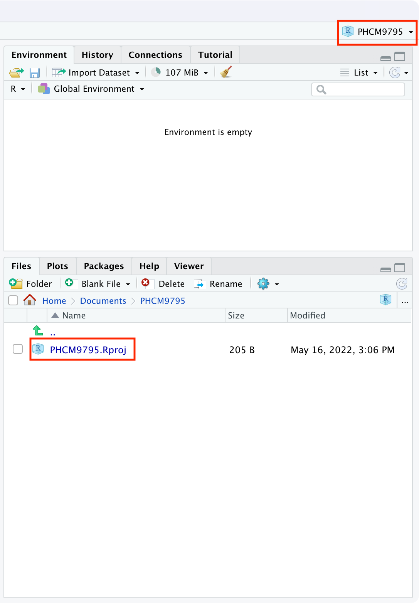
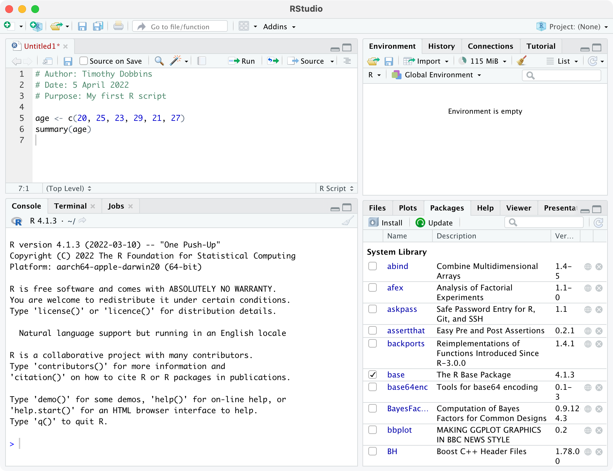

# Introduction {.unnumbered}

These notes provide an introduction to R and instructions on how to conduct the analyses introduced in Foundations of Biostatistics.

These notes are currently under development, with sections being added and revised as the course progresses.

This is the first year that R has been offered as an option. I am keen to receive feedback about the notes and your experience learning R. Please [get in touch](mailto:t.dobbins@unsw.edu.au) if anything is unclear, or you have any questions or suggestions.

### Changelog {-}

**2022-08-10**

[Added]

- Module 10: definitions of `r` in unequal-group sample size calculations.

**2022-08-02**

[Added]

- Module 10: first release.

**2022-07-27**

[Added]

- Module 9: first release.

**2022-07-16**

[Added]

- Module 8: first release.

**2022-07-14**

[Added]

- Module 7: first release.

**2022-07-05**

[Added]

- Module 6: first release.

**2022-06-20**

[Added]

- Module 5: first release.

**2022-06-14**

[Changed]

- Section 2.12 - corrected the `pnorm(q, mean, sd, lower.tail=FALSE)` documentation to state that the it is the probablity of obtaining **more than** q that is calculated.

- Section 3.1 - recommendation to use `t.test()` to calculate a 95% confidence interval for a mean, and not the `descriptives()` function as `descriptives()` uses a z-value instead of a t-value.

**2022-06-10**

[Added]

- Section 2.10 - Added instructions on labelling groups using the `cut()` function

**2022-06-09**

[Added]

- Section 2.8 - Summarising a single column of data using the `descriptives()` function from `jmv` package.

**2022-06-07**

[Changed]

- Section 2.6: Use the `<-` operator instead of `=`

**2022-06-05**

[Changed]

- Module 1: Typos


**2022-05-30**

[Changed]

- Module 1: Typo in R Preferences (Section 1.3.1)

[Added]

- Section 1.12: Instructions to plot a histogram with relative frequencies (i.e. percents) instead of frequencies

**2022-05-27**

[Changed]

- Module 1: Fixed bar-charts that were not plotted correctly

**2022-05-27**

[Added]

-   Section 1.2.1: Added a note about using the "patched" version of R 4.2.0 for Windows
-   Section 1.14: Instructions for creating two-way tables using the `contTables()` function in the `jmv` package

**2022-05-23**

[Added]

-   Section 1.9: Explicit instructions to install `jmv` and `summarytools` when working in Module 1

[Changed]

-   Section 1.9: Changed location of `pbc.dat` from `examples` to `activities` folder for consistency

**2022-05-19**

Initial release

<!--chapter:end:index.Rmd-->

# Introduction to R and RStudio

## Learning outcomes {.unnumbered}

By the end of this Module, you will be able to:

-   understand the difference between R and RStudio
-   navigate the RStudio interface
-   input and import data into R
-   use R to summarise data
-   perform basic data transformations
-   understand the difference between saving R data and saving R output
-   copy R output to a standard word processing package

## Part 1: An introduction to R {.unnumbered}

"R is a language and environment for statistical computing and graphics." [Link](https://www.r-project.org/about.html). It is an open-source programming language, used mainly for statistics (including biostatistics) and data science.

The aim of these notes is to introduce the R language within the RStudio environment, and to introduce the commands and procedures that are directly relevant to this course. There is so much more to R than we can cover in these notes. Relevant information will be provided throughout the course, and we will provide further references that you can explore if you are interested.

## R vs RStudio

At its heart, R is a programming language. When you install R on your computer, you are installing the language and its resources, as well as a very basic interface for using R. You can write and run R code using the basic R app, but it's not recommended.

RStudio is an "Integrated Development Environment" that runs R while also providing useful tools to help you write code and analyse data. You can think of R as an engine which does the work, and RStudio as a car that uses the engine, but also provides useful tools like GPS navigation and reversing cameras that help you drive.

Note: even though we recommend that you use RStudio, you still need install R. **RStudio will not run without R installed.**

|                       R: Don't run this                        |                            RStudio: Run this instead                             |
|:------------------------------:|:--------------------------------------:|
|  |  |

## Installing R and RStudio

### To install R on your computer

1.  Download the R installer from:

    a.  for Windows: <https://cran.r-project.org/bin/windows/base/>
    b.  for MacOS: <https://cran.r-project.org/bin/macosx/>

    -   **Note for Windows users:** as at May 27, 2022, R Version 4.2.0 has compatability issues with RStudio. You should download and install R from <https://cran.r-project.org/bin/windows/base/rpatched.html>

2.  Install R by running the installer and following the installation instructions. The default settings are fine.

    -   **Note for macOS:** if you are running macOS 10.8 or later, you will need to install an additional application called XQuartz, which is available at <https://www.xquartz.org/>. Download the latest installer (XQuartz-2.8.1.dmg as of April 2022), and install it in the usual way.

3.  Open the R program. You should see a screen as below:

```{r echo=FALSE, fig.show="hold", out.width="80%"}
knitr::include_graphics("img/R-screenshot.png")
```

Near the bottom of the R screen, you will find the "\>" symbol which represents the command line. If you type `1 + 2` into the command line and then hit enter you should get:

`[1] 3`

This is R performing your calculation, with the `[1]` indicating that the solution to `1 + 2` is a single number (the number 3).

At this point, close R - we will not interact with R like this in the future. You can close R by typing `quit()` at the command prompt, followed by the return key, or in the usual way of closing an application in your operating system. There is no need to save anything here if prompted.

### To install RStudio on your computer

1.  Make sure you have already installed R, and verified that it is working.
2.  Download the RStudio desktop installer at: <https://www.rstudio.com/products/rstudio/download>. Ensure that you select the RStudio Desktop (Free) installer in the first column.
3.  Install RStudio by running the installer and following the installation instructions. The default settings are fine.
4.  Open RStudio, which will appear as below:

```{r echo=FALSE, fig.show="hold", out.width="100%"}
knitr::include_graphics("img/RStudio-screenshot-01.png")
```

Locate the command line symbol "\>" at the bottom of the left-hand panel. Type `1 + 2` into the command line and hit enter, and you will see:

`[1] 3`

This confirms that RStudio is running correctly, and can use the R language to correctly calculate the sum between 1 and 2!

RStudio currently comprises three window panes, and we will discuss these later.

## Recommended setup

I will provide a recommended setup for R and RStudio in this section. You are free to use alternative workflows and setup, but this setup works well in practice.

### RStudio preferences

By default, RStudio will retain data, scripts and other objects when you quit your RStudio session. Relying on this can cause headaches, so I recommend that you set up RStudio so that it does not preserve your workspace between sessions. Open the RStudio options:

-   Mac: **RStudio \> Preferences**

-   Windows: **Tools \> Options**

and **deselect "Restore .RData into workplace at startup"**, and choose: "**Save workspace to .RData on exit:** **Never"**.

```{r echo=FALSE, fig.show="hold", out.width="75%"}
knitr::include_graphics("img/RStudio-preferences.png")
```

### Set up a project

A project in RStudio is a folder that RStudio recognises as a place to store R scripts, data files, figures that are common to an analysis project. Setting up a folder allows much more simple navigation and specification of data files and output. More detail can be found in Chapter 8 of the excellent text: [R for Data Science](https://r4ds.had.co.nz/workflow-projects.html). Using projects is not necessary, but I recommend working with projects from day one.

We will create a project called **PHCM9795** to store all the data you will use and scripts that you will write in this course. First, think about where you want to store your project folder: this could be somewhere in your *Documents* folder.

Step 1: Choose **File \> New Project...** in RStudio to open the **Create Project** dialog box:

```{r echo=FALSE, fig.show="hold", out.width="75%"}

```

Step 2: Click the first option to create a project in a **New directory**

```{r echo=FALSE, fig.show="hold", out.width="75%"}

```

Step 3: Click the first option: **New Project**. Give the project a name, by typing PHCM9795 in the "Directory name", and choose where you want to store the project by clicking the **Browse** button.

```{r echo=FALSE, fig.show="hold", out.width="75%"}

```

Step 4: Click **Create** to create your project.

You will now have a new folder in your directory, which contains only one file: PHCM9795.Rproj, and the two right-hand panes of RStudio will appear as below:

```{r echo=FALSE, fig.show="hold", out.width="75%"}

```

The top-right menu bar is showing that you are working within the PHCM9795 project, and the bottom-right window is showing the contents of that window: the single PHCM9795.Rproj file. We will add some more files to this project later.

## A simple R analysis {#simpleR}

In this very brief section, we will introduce R by calculating the average of six ages.

To begin, open a new R Script by choosing **File \> New file \> R Script** . A script (or a program) is a collection of commands that are sequentially processed by R. You can also type Ctrl+Shift+N in Windows, or Command+Shift+N in MacOS to open a new script in RStudio, or click the **New File** button at the top of the RStudio window.

You should now see four window panes, as below. In the top-left window, type the following (replacing my name with yours, and including today's date):

```{r eval=FALSE}
# Author: Timothy Dobbins
# Date: 5 April 2022
# Purpose: My first R script

age <- c(20, 25, 23, 29, 21, 27)
summary(age)
```

**Note: R is case-sensitive**, so you should enter the text exactly as written in these notes.

Your screen should look something like:

```{r echo=FALSE, fig.show="hold", out.width="100%"}

```

To run your script, choose **Code \> Run Region \> Run All**. You will see your code appear in the bottom-left window, with the following output:

```{r eval=FALSE}
> # Author: Timothy Dobbins
> # Date: 5 April 2022
> # Purpose: My first R script
> 
> age <- c(20, 25, 23, 29, 21, 27)

> summary(age)
   Min. 1st Qu.  Median    Mean 3rd Qu.    Max. 
  20.00   21.50   24.00   24.17   26.50   29.00 
```

We will explain the key parts of this script later, but for now, you have entered six ages and calculated the mean age (along with five other summary statistics).

Save your script within the PHCM9795 project by using **File \> Save As**, using the name `my_first_analysis.R`.

## The RStudio environment

Now that we have seen a simple example of how to use R within RStudio, let's describe the RStudio environment. Let's assume that you have just run your first R script, and you have four windows as below:

```{r echo=FALSE, fig.show="hold", out.width="100%"}
knitr::include_graphics("img/RStudio-screenshot-03.png")
```

The top-left window is call the **Source** window, and is where you write and edit your R scripts. Scripts can be saved by clicking **File \> Save As** or by clicking on the symbol of a floppy disk at the top of the script. The file will have an extension of .R, for example script.R. Remember to give your script a meaningful title and remember to periodically save as you go.

In RStudio, the name of the script will be black when it has been saved, and will change to red if you have any unsaved changes.

The **Console** window, at the bottom left, contains the command line which is indicated with the symbol \>. You can type commands here, but anything executed directly from the console is not saved and therefore is lost when the session ends (when you exit RStudio). You should always run your commands from a script file which you can save and use again later. When you run commands from a script, the output and any notes/errors are shown in the console. The Terminal and Jobs tabs will not be used in this course.

The **Environment** window at the top-right shows a list of objects that have been created during your session. When you close your RStudio session these objects will disappear. We will not use the History or Connections tabs in this course.

The bottom right corner contains some useful tabs, in particular the **Help** tab. When you are troubleshooting errors or learning how to use a function, the Help tab should be the first place you visit. Here you can search the help documents for all the packages you have installed. Whenever you create plots in R, these will be shown in the **Plots** tab. The **Packages** tab contains a list of installed packages and indicates which ones are currently in use (we will learn about packages later). Packages which are loaded, i.e. in use, are indicated with a tick. Some packages are in use by default when you begin a new session. You can access information about a package by clicking on its name. The **Files** tab provides a shortcut to access your files. The Viewer tab will not be used in this course.

## Some R basics

While we use R as a statistics package, R is a programming language. In order to use R effectively, we need to define some basics.

### Scripts

While R can be run completely from the command line, issuing commands one-by-one, it is most commonly run using **scripts**. A script is simply a list of commands that are processed in order. The simple analysis we conducted earlier is a very simple script. Some things to know about R scripts:

-   anything appearing after a \# is a comment, and is ignored by R. The first three lines of our script are there for ourselves (either as writers of code, or readers of code). I include comments at the beginning of each of my scripts to describe:

    -   who wrote the script (useful if someone else uses your script and wants to ask questions about it);

    -   when the script was written;

    -   what the script does. This last point may seem odd, but it's useful to describe what this script does, and why it might differ to other scripts being used in the analysis. This is particularly useful if your scripts become long and complex.

-   **R is case-sensitive**. So `age`, `AGE` and `Age` could refer to three separate variables (please don't do this!)

-   use blank lines and comments to separate sections of your script

### Objects

If you do some reading about R, you may learn that R is an "object-oriented programming language". When we enter or import data into R, we are asking R to create **objects** from our data. These objects can be manipulated and transformed by **functions**, to obtain useful insights from our data.

Objects in R are created using the **assignment operator**. The most common form of the assignment operator looks like an arrow: `<-` and is typed as the `<` and `-` symbols. The simplest way of reading `<-` is as the words "is defined as". Note that it possible to use `->` and even `=` as assignment operators, but their use is less frequent.

Let's see an example:

```{r}
x <- 42
```

This command creates a new object called `x`, which is defined as the number 42 (or in words, "`x` is defined as 42"). Running this command gives no output in the console, but the new object appears in the top-right **Environment** panel. We can view the object in the console by typing its name:

```{r}
# Print the object x
x
```

Now we see the contents of `x` in the console.

This example is rather trivial, and we rarely assign objects of just one value. In fact, we created an object earlier, called `age`, which comprised six values.

### Data structures

There are two main structures we will use to work with data in this course: **vectors** and **data frames**. A **vector** is a combination of data values, all of the same type. For example, our six ages that we entered earlier is a vector. You could think of a vector as a column of data (even though R prints vectors as rows!) And technically, even an object with only one value is a vector, a vector of size 1.

The easiest way of creating a vector in R is by using the `c()` function, where c stands for 'combine'. In our previous Simple Analysis in R (Section \@ref(simpleR)), we wrote the command:

```{r eval=FALSE}
age <- c(20, 25, 23, 29, 21, 27)
```

This command created a new object called `age`, and *combined* the six values of age into one vector.

Just as having a vector of size 1 is unusual, having just one column of data to analyse is also pretty unusual. The other structure we will describe here is a **data frame** which is essentially a collection of vectors, each of the same size. You could think of a data frame as being like a spreadsheet, with columns representing variables, and rows representing observations.

There are other structures in R, such as matrices and lists, which we won't discuss in this course. And you may come across the term **tibble**, which is a type of data frame.

### Functions

If objects are the nouns of R, functions are the verbs. Essentially, functions transform objects. Functions can transform your data into summary statistics, graphical summaries or analysis results. For example, we used the `summary()` function to display summary statistics for our six ages.

R functions are specified by their arguments (or inputs). The arguments that can be supplied for each function can be inspected by examining the help notes for that function. To obtain help for a function, we can submit `help(summary)` (or equivalently `?summary`) in the console, or we can use the **Help** tab in the bottom-right window of RStudio. For example, the first part of the help notes for `summary` appear as:

```{r echo=FALSE, fig.show="hold", out.width="80%"}
knitr::include_graphics("img/help-1.png")
```

The help notes in R can be quite cryptic, but the **Usage** section details what inputs should be specified for the function to run. Here, `summary` requires an object to be specified. In our case, we specified `age`, which is our object defined as the vector of six ages.

Most help pages also include some examples of how you might use the function. These can be found at the very bottom of the help page.

```{r echo=FALSE, fig.show="hold", out.width="80%"}
knitr::include_graphics("img/help-2.png")
```

The `summary()` function is quite simple, in that it only requires one input, the object to be summarised. More complex functions might require a number of inputs. For example, the help notes for the `descriptives()` function in the `jmv` package show a large number of inputs can be specified:

```{r echo=FALSE, fig.show="hold", out.width="80%"}
knitr::include_graphics("img/help-3.png")
```

There are two things to note here. First, notice that the first two inputs are listed with no = symbol, but all other inputs are listed with = symbols (with values provided after the = symbol). This means that everything apart from `data` and `vars` have **default** values. We are free to not specify values for these inputs if we are happy with the defaults provided. For example, by default the variance is not calculated (as `variance = FALSE`). To obtain the variance as well as the standard deviation, we can change this default to `variance = TRUE`:

```{r, eval=FALSE}
# Only the standard deviation is provided as the measure of variability
descriptives(data=pbc, vars=age)

# Additionally request the variance to be calculated
descriptives(data=pbc, vars=age, variance=TRUE)
```

Second, for functions with multiple inputs, we can specify the input name and its value, or we can ignore the input name and specify just the input values **in the order listed in the Usage section**. So the following are equivalent:

```{r, eval=FALSE}
# We can specify that the dataset to be summarised is pbc,
#   and the variable to summarise is age:
descriptives(data=pbc, vars=age)

# We can omit the input name, as long as we keep the inputs in the correct order - 
#   that is, dataset first, variable second:
descriptives(pbc, age)

# We can change the order of the inputs, as long as we specify the input name:
descriptives(vars=age, data=pbc)
```

In this course, we will usually provide all the input names, even when they are not required. As you become more familiar with R, you will start to use the shortcut method.

#### The curse of inconsistency

As R is an open-source project, many people have contributed to its development. This has led to a frustrating part of R: some functions require a single object to be specified, but some require you to specify a data frame and select variables for analysis. Let's see an example.

The help for `summary()` specifies the usage as: `summary(object, ...)`. This means we need to specify a single object to be summarised. An object could be a single column of data (i.e. a vector), or it could be a data frame. If we have a data frame called `pbc` which contains many variables, the command `summary(pbc)` would summarise every variable in the data frame.

What if we only wanted to summarise the age of the participants in the data frame? To select a single variable from a data frame, we can use the following syntax: `dataframe$variable`. So to summarise just age from this data frame, we would use: `summary(pbc$age)`.

Compare this with the `descriptives()` function in the `jmv` package. We saw earlier that the two required inputs for `descriptives()` are `data` (the data frame to be analysed) and `vars` (the variables to be analysed). So to summarise `age` from the `pbc` data frame, we would specify `descriptives(data=pbc, vars=age)`.

This inconsistency will seem maddening at first, and will continue to be maddening! Reading the **usage** section of the help pages is a useful way to determine whether you should specify an object (like `pbc$age`) or a data frame and a list of variables.

### Packages

A **package** is a collection of functions, documentation (and sometimes datasets) that extend the capabilities of R. Packages have been written by R users to be freely distributed and used by others. R packages can be obtained from many sources, but the most common source is CRAN: the Comprehensive R Archive Network.

A useful way of thinking about R is that R is like a smartphone, with packages being like apps which are downloaded from CRAN (similar to an app-store). When you first install R, it comes with a basic set of packages (apps) installed. You can do a lot of things with these basic packages, but sometimes you might want to do things differently, or you may want to perform some analyses that can't be done using the default packages. In these cases, you can install a package.

Like installing an app on a smartphone, you only need to *install* a package once. But each time you want to use the package, you need to *load* the package into R.

### How to install a package

There are a couple of ways to install a package. You can use the `install.packages()` function if you know the exact name of the package. Let's use an example of installing the `skimr` package, which gives a very nice, high-level overview of any data frame. We can install `skimr` by typing the following into the console:

```{r, eval=FALSE}
install.packages("skimr")
```

Note the use of the quotation marks.

Alternatively, RStudio offers a graphical way of installing packages that can be accessed via **Tools \> Install Packages**, or via the **Install** button at the top of the **Packages** tab in the bottom-right window. You can begin typing the name of the package in the dialog box that appears, and RStudio will use predictive text to offer possible packages:

```{r echo=FALSE, fig.show="hold", out.width="60%"}
knitr::include_graphics("img/install-packages.png")
```

While writing code is usually the recommended way to use R, installing packages is an exception. Using **Tools \> Install Packages** is perfectly fine, because you only need to install a package once.

### How to load a package

When you begin a new session in RStudio, i.e. when you open RStudio, only certain core packages are automatically loaded. You can use the `library()` function to load a package that you has previously been installed. For example, now that we have installed `skimr`, we need to load it before we can use it:

```{r}
library(skimr)
```

Note that quotation marks are not required for the `library()` function (although they can be included if you really like quotation marks!).

#### Installing vs loading packages {.unnumbered}

Package installation:

-   use the `install.packages()` function (note the 's') or **Tools \> Install packages**
-   the package name must be surrounded by quotation marks
-   only needs to be done once

Package loading

-   use the `library()` function
-   the package name does not need to be surrounded by quotation marks
-   must be done for each R session

## What is this thing called the tidyverse?

If you have done much reading about R, you may have come across the tidyverse:

> "The tidyverse is an opinionated collection of R packages designed for data science. All packages share an underlying design philosophy, grammar, and data structures." <https://www.tidyverse.org/>

Packages in the tidyverse have been designed with a goal to make using R more consistent by defining a "grammar" to manipulate data, examine data and draw conclusions from data. While the tidyverse is a common and powerful set of packages, we will not be teaching the tidyverse in this course for two main reasons:

1.  The data we provide have been saved in a relatively tidy way, and do not need much manipulation for analyses to be conducted. The cognitive load in learning the tidyverse in this course is greater than the benefit that could be gained.
2.  There are many resources (online, in print etc) that are based on `base R`, and do not use the tidyverse. It would be difficult to understand these resources if we taught only tidyverse techniques. In particular, the `dataframe$variable` syntax is an important concept that should be understood before moving into the tidyverse.

In saying all of this, I think the tidyverse is an excellent set of packages, which I frequently use. At the completion of this course, you will be well equipped to teach yourself tidyverse using many excellent resources such as: [Tidyverse Skills for Data Science](https://jhudatascience.org/tidyversecourse/) and [R for Data Science](https://r4ds.had.co.nz/).

## Part 2: Obtaining basic descriptive statistics {.unnumbered}

In this exercise, we will analyse data to complete a descriptive table from a research study. The data come from a study in primary biliary cirrhosis, a condition of the liver, from Modeling Survival Data: Extending the Cox Model @therneau_grambsch10. By the end of this exercise, we will have completed the following table.

```{r echo=FALSE, message=FALSE, warning=FALSE}
library(tidyverse)
library(magrittr)

tab <- tibble::tribble(
                     ~Characteristic,                   ~` `,                    ~Summary,
                       "Age (years)",                     NA, "Mean (SD) or Median [IQR]",
                               "Sex",                 "Male",                     "n (%)",
                               "Sex",               "Female",                     "n (%)",
                       "AST* (U/ml)",                     NA, "Mean (SD) or Median [IQR]",
                   "Serum bilirubin",                     NA, "Mean (SD) or Median [IQR]",
                             "Stage",                    "I",                     "n (%)",
                             "Stage",                   "II",                     "n (%)",
                             "Stage",                  "III",                     "n (%)",
                             "Stage",                   "IV",                     "n (%)",
         "Vital status at study end", "Alive: no transplant",                     "n (%)",
         "Vital status at study end",    "Alive: transplant",                     "n (%)",
         "Vital status at study end",             "Deceased",                     "n (%)"
         )

huxtable::huxtable(tab) %>% 
  huxtable::theme_article() %>% 
  huxtable::merge_repeated_rows(huxtable::everywhere, 1) %>% 
  huxtable::set_width(0.95) %>% 
  huxtable::set_caption("Summary of 418 participants from the PBC study (Therneau and Grambsch, 2000)") %>% 
  huxtable::add_footnote("* asparate aminotransferase")
```

This table is available in Table1.docx, saved on Moodle.

## Set up your data

We created a project in the previous step. We will now create a folder to store all the data for this course. Storing the data within the project makes life much easier!

Create a new folder by clicking the **New Folder** icon in the **Files** tab at the bottom-right:

```{r echo=FALSE, fig.show="hold", out.width="75%"}
knitr::include_graphics("img/NewFolder-1.png")
```

Call the new folder **data**.

Click on this folder to open it, and then create two new folders: **activities** and **examples**.

Download the "Data sets: for learning activities" from Moodle, and use Windows Explorer or MacOS Finder to save these data sets in **activities**. Save the "Data sets: example data from course notes" into the **examples** folder.

Your **activities** folder should look like:

```{r echo=FALSE, fig.show="hold", out.width="75%"}
knitr::include_graphics("img/data-folder.png")
```

Click the two dots next to the up-arrow at the top of the folder contents to move back up the folder structure. Note that you need to click the dots, and not the up-facing green arrow!

## Reading a data file

Typing data directly into R is not common; we usually read data that have been previously saved. In this example, we will read an `.rds` file using the `readRDS()` function, which has only one input: the location of the file.

1 - Confirm that the `pbc.rds` file is in the `activities` sub-folder within the `data` folder (as per the previous steps).

2 - Install the packages: `jmv`, `skimr` and `summarytools` using **Tools \> Install packages**, or by typing into the console:

`install.packages("jmv")`

`install.packages("skimr")`

`install.packages("summarytools")`

3 - Load the `skimr` package, and use the `readRDS()` function to read the file into R, assigning it to a data frame called `pbc`. Because we set up our project, we can locate our data easily by telling R to use the file: `"data/activities/pbc.rds"`, which translates as: the file `pbc.rds` which is located in the `activities` sub-folder within the `data` folder.

```{r}
library(skimr)

pbc <- readRDS("data/activities/pbc.rds")
```

4 - We can now use the `summary()` function to examine the pbc dataset:

```{r}
summary(pbc)
```

An alternative to the `summary()` function is the `skim()` function in the `skimr` package, which produces summary statistics as well as rudimentary histograms:

```{r, eval=FALSE}
skim(pbc)
```

```{r echo=FALSE, fig.show="hold", out.width="90%"}
knitr::include_graphics("img/skim-pbc.png")
```

The `summary()` and `skim()` functions are useful to give a quick overview of a dataset: how many variables are included, how variables are coded, which variables contain missing data and a crude histogram showing the distribution of numeric variables.

## Summarising continuous variables

One of the most flexible functions for summarising continuous variables is the `descriptives()` function from the `jmv` package. The function is specified as `descriptives(data=, vars=)` where:

-   `data` specifies the dataframe to be analysed
-   `vars` specifies the variable(s) of interest, with multiple variables combined using the `c()` function

We can summarise the three continuous variables in the pbc data: age, AST and serum bilirubin, as shown below.

```{r}
library(jmv)

descriptives(data=pbc, vars=c(age, ast, bili))
```

By default, the `descriptives` function presents the mean, median, standard deviation, minimum and maximum. We can request additional statistics, such as the quartiles (which are called the percentiles, or pc, in the descriptives function):

```{r}
descriptives(data=pbc, vars=c(age, ast, bili), pc=TRUE)
```

## Producing a histogram

We can use the `hist()` function to produce a histogram, specifying the dataframe to use and the variable to be plotted as `dataframe$variable`:

```{r}
hist(pbc$age)
```

The histogram function does a remarkably good job of choosing cutpoints and binwidths, and these rarely need to be changed. However, the labelling of the histogram should be improved by using `xlab=" "` and `main=" "` to assign labels for the x-axis and overall title respectively:

```{r}
hist(pbc$age, xlab="Age (years)", 
     main="Histogram of participant age from pbc study data")
```

By default, the `hist()` function plots a **frequency histogram**, with counts on the y-axis. We can tweak the histogram using the following code to plot a histogram of the **relative frequencies**:

```{r}
h <- hist(pbc$age, plot=FALSE)
h$density <- h$counts/sum(h$counts)*100
plot(h, freq=FALSE, 
     xlab="Age (years)", 
     ylab="Relative frequency (%)",
     main="Histogram of participant age from pbc study data")
```

## Producing a boxplot

The `boxplot` function is used to produce boxplots, again specifying the dataframe to use and the variable to be plotted as `dataframe$variable`. Labels can be applied in the same way as the histogram:

```{r}
boxplot(pbc$age, xlab="Age (years)", main="Boxplot of participant age from pbc study data")
```

## Producing a one-way frequency table

We have three categorical variables to summarise in Table 1: sex, stage and vital status. These variables are best summarised using one-way frequency tables.

```{r message=FALSE}
library(summarytools)

freq(pbc$sex)
```

### Defining categorical variables as factors

You will notice that the table above, in its current form, is uninterpretable as the 1 and 2 categories are not labelled. In this course, all variables including categorical variables tend to be numerically coded. To define a categorical variable as such in R, we define it as a **factor** using the factor function:

`factor(variable=, levels=, labels=)`

We specify:

-   levels: the values the categorical variable can take
-   labels: the labels corresponding to each of the levels (entered in the same order as the levels)

To define our variable sex as a factor, we use:

```{r}
pbc$sex <- factor(pbc$sex, levels=c(1, 2), labels=c("Male", "Female"))
```

We can confirm the coding by re-running a frequency table:

```{r}
freq(pbc$sex)
```

> Task: define `stage` and `status` (Vital Status) as factors, and produce one-way frequency tables. Refer to the file `pbc_info.txt` to view the labels for each variable. For example, for Stage:

```{r}
pbc$stage <- factor(pbc$stage, levels=c(1, 2, 3, 4), labels=c("Stage 1", "Stage 2", "Stage 3", "Stage 4"))
freq(pbc$stage)
```

## Producing a two-way frequency table

To produce tables summarising two categorical variables, we can use the `contTables()` function within the `jmv` package. The minimal inputs to include are `data`: the name of the data frame to be analysed, `rows`: the variable representing the rows of the table, and `cols`: the name of the columns of the table.

For example, to produce a two-way table showing stage of disease by sex using the pbc data frame, we use:

```{r}
contTables(data=pbc, rows=sex, cols=stage)
```

[The bottom part of the output, χ² Tests, can be ignored for now]

You may notice in the above that the number of observations is now 412. This is because there are missing observations for either sex or stage: which is it, and how would you determine this?

From the cross-tabulation, you can see the individual frequencies of participants in each of the categories in each cell. For example, there are 3 male participants who have Stage 1 disease. You can also read the totals for each row and column. For example, there are 44 males, and 144 participants have Stage 4 disease.

You can also add percentages into your table using `pcCol=TRUE` to include column percents, and `pcRow=TRUE` for row percents. For example, to calculate the relative frequencies (i.e. percentages) of sex within each stage, we would request **column percents** with the option: `pcCol=TRUE`.

```{r}
contTables(data=pbc, rows=sex, cols=stage, pcCol=TRUE)
```

We can see that the 3 male participants with Stage 1 disease represent 14% of those with Stage 1 disease.

## Saving data in R

There are many ways to save data from R, depending on the type of file you want to save. The recommendation for this course is to save your data using the `.rds` format, using the `saveRDS()` function, which takes two inputs: `saveRDS(object, file)`. Here, `object` is the R object to be saved (usually a data frame), and `file` is the location for the file to be saved (file name and path, including the `.rds` suffix).

It is not necessary to save our PBC data, as we have made only minor changes to the data that can be replicated by rerunning our script. If you had made major changes and wanted to save your data, you could use:

`saveRDS(pbc, file="pbc_revised.rds")`

## Copying output from R

It is important to note that saving your data or your script in R will not save your output. The easiest way to retain the output of your analyses is to copy the output from the Console into a word processor package (e.g. Microsoft Word) before closing R.

Unfortunately, by default, R is not ideal for creating publication quality tables. There are many packages that will help in this process, such as R Markdown, bookdown[^introtor-1], huxtable, gt and gtsummary, but their use is beyond the scope of this course. [R Markdown for Scientists](https://rmd4sci.njtierney.com/) provides an excellent introduction to R Markdown.

[^introtor-1]: these R notes and the PHCM9795 course notes have been written using [bookdown](https://bookdown.org/yihui/bookdown/)

> Task: Complete Table 1 using the output generated in this exercise. You should decide on whether to present continuous variables by their means or medians, and present the most appropriate measure of spread. Include footnotes to indicate if any variables contain missing observations.

## Part 3: Creating other types of graphs {.unnumbered}

The `plot()` function, also known as *base graphics*, is the default method of plotting data in R that can produce publication-quality graphics with minimal coding. There are alternative packages for plotting, with `ggplot2` being one of the most well known. We will present instructions for base graphics in this course, but excellent documentation for `ggplot2` can be found at the [ggplot2: Elegant Graphics for Data Analysis](https://ggplot2-book.org/) website, written by the package authors.

## Bar graphs

The simplest way to use the `plot()` function is by specifying an object to be plotted. As with the `hist()` function, to plot a single variable from a data frame, we must define it using: `dataframe$variable`.

Here we will create the bar chart shown in Figure 1.3 of the statistics notes using the `pbc.rds` dataset. The x-axis of this graph will be the stage of disease, and the y-axis will show the number of participants in each category.

```{r}
plot(pbc$stage, 
     main="Bar graph of stage of disease from PBC study", 
     ylab="Number of participants")
```

Note that stage is a categorical variable, that has been defined as a factor (in Section \@ref(defining-categorical-variables-as-factors)). You **must define categorical data as factors** to plot them in a bar graph.

### Clustered bar graph

To create a clustered bar chart as shown in Figure 1.4 of the statistics notes, we need to do a bit of manipulation. We first need to tabulate the data using the `table()` function. We want to plot stage of disease broken down by sex, so we specify `sex` as the first variable, and `stage` as the second variable for the `table()` command.

```{r}
counts <- table(pbc$sex, pbc$stage)
counts
```

After tabulating the data, we use the `barplot()` function to plot the summarised data. We specify the main title using `main=" "`, specify that the stages be plotted separately by sex (`beside=TRUE`), specify the legend be defined by sex, and position the legend in the top-left of the graph:

```{r}
barplot(counts, main="Bar graph of stage of disease by sex from PBC study",
        beside=TRUE, legend = rownames(counts), args.legend = list(x = "topleft"))
```

### Stacked bar graph

A stacked bar graph can be constructed as for the clustered bar graph, but we specify `beside=FALSE`:

```{r}
barplot(counts, main="Bar graph of stage of disease by sex from PBC study",
        beside=FALSE, legend = rownames(counts), args.legend = list(x = "topleft"))
```

### Stacked bar graph of relative frequencies

To plot relative frequencies, we need to transform our table of frequencies (`counts`) into proportions, by using the `prop.table()` function. The prop.table() function takes two arguments: a table of counts, and `margin`, which defines whether we want proportions calculated by row (`margin=1`) or column (`margin=2`).

We want to calculate the relative frequency of sex within each stage category. From our `counts` table above, this equates to calculating *column* proportions, so we specify `margin=2`. We also multiply the resulting table by 100 to obtain percentages (rather than proportions):

```{r}
percent <- prop.table(counts, margin=2)*100
percent
```

After calculating the percentages, we use `barplot()` again, similar to the stacked bar graph:

```{r}
barplot(percent, 
        main="Relative frequency of sex within stage of disease from PBC study",
        legend = rownames(counts), beside=FALSE, args.legend = list(x = "topright"))
```

## Creating line graphs

To demonstrate the graphing of aggregate data , we use the data on new cases and deaths from prostate cancer in males in NSW. This data has been entered as `Example_1.2.rds`.

```{r}
cancer <- readRDS("data/examples/Example_1.2.rds")
summary(cancer)
```

We begin by plotting cancer cases (as the *y* variable) against year (the *x* variable).

```{r}
plot(x=cancer$year, y=cancer$rcases)
```

Let's define the plot to be joined by lines (`type="l"`), in the colour red (`col="red"`), providing meaningful labels for the x-axis and y-axis, and changing the scale of the y-axis to be between 0 and 200 (`ylim=c(0,200)`):

```{r}
plot(x=cancer$year, y=cancer$rcases, 
     type="l", col = "red", 
     xlab = "Year", 
     ylab = "Age-standardised rate (per 100,000)", ylim=c(0,200))
```

We can now add a second line to the plot using the `lines()` function, specifying a dashed line (`lty=2`), and add a legend to the plot:

```{r}
plot(x=cancer$year, y=cancer$rcases, type="l", col = "red", 
     xlab = "Year", ylab = "Age-standardised rate (per 100,000)", 
     ylim=c(0,200))

lines(cancer$year, cancer$rdeaths, col = "blue", type = "l", lty = 2)

legend("topleft", legend=c("Incidence", "Deaths"), 
       col=c("red", "blue"), lty = 1:2)
```

Note: coding for graphs is not always straightforward. Two excellent resources for creating graphs in R are: [R Graphics Cookbook](https://r-graphics.org/) and [The R Graph Gallery](https://r-graph-gallery.com/).

<!--chapter:end:01-IntroToR.Rmd-->

# Probability and probability distributions

## Importing data into R

We have described previously how to import data that have been saved as R .rds files. It is quite common to have data saved in other file types, such as Microsoft Excel, or plain text files. In this section, we will demonstrate how to import data from other packages into R.

There are two useful packages for importing data into R: `haven` (for data that have been saved by Stata, SAS or SPSS) and `readxl` (for data saved by Microsoft Excel). Additionally, the `labelled` package is useful in working with data that have been labelled in Stata.

### Importing plain text data into R

A `csv` file, or a "comma separated variables" file is commonly used to store data. These files have a very simple structure: they are plain text files, where data are separated by commas. csv files have the advantage that, as they are plain text files, they can be opened by a large number of programs (such as Notepad in Windows, TextEdit in MacOS, Microsoft Excel - even Microsoft Word). While they can be opened by Microsoft Excel, they can be opened by many other programs: the csv file can be thought of as the lingua-franca of data.

In this demonstration, we will use data on the weight of 1000 people entered in a csv file called `weight_s2.csv` available on Moodle.

To confirm that the file is readable by any text editor, here are the first ten lines of the file, opened in Notepad on Microsoft Windows, and TextEdit on MacOS.

```{r , echo=FALSE, out.width = "66%",}

```

We can use the `read.csv` function:

```{r}
sample <- read.csv("data/examples/Weight_s2.csv")
```

Here, the `read.csv` function has the default that the first row of the dataset contains the variable names. If your data do not have column names, you can use `header=FALSE` in the function.

Note: there is an alternative function `read_csv` which is part of the `readr` package (a component of the `tidyverse`). Some would argue that the `read_csv` function is more appropriate to use because of an issue known as `strings.as.factors`. The `strings.as.factors` default was removed in R Version 4.0.0, so it is less important which of the two functions you use to import a `.csv` file. More information about this issue can be found [here](https://simplystatistics.org/posts/2015-07-24-stringsasfactors-an-unauthorized-biography) and [here](https://developer.r-project.org/Blog/public/2020/02/16/stringsasfactors/).

## Checking your data for errors in R

Before you start describing and analysing your data, it is important to make sure that no errors have been made during the data entry process. Basically, you are looking for values that are outside the range of possible or plausible values for that variable.

If an error is found, the best method for correcting the error is to go back to the original data e.g. the hard copy questionnaire, to obtain the original value, entering the correct value into R If the original data is not available or the original data is also incorrect, the erroneous value is often excluded from the dataset.

For continuous variables, the easiest methods are to examine a boxplot and histogram. For example, a boxplot and histogram for the weight variable we just imported appear as:

```{r}
hist(sample$weight, xlab="Weight (kg)", main="Histogram of 1000 weights")
boxplot(sample$weight, xlab="Weight (kg)", main="Boxplot of 1000 weights")
```

There is a clear outlying point shown in the boxplot. Although not obvious, the same point is shown in the histogram as a bar around 700 with a very short height.

We can identify any outlying observations in the dataset using the `subset` function. You will need to decide if these values are a data entry error or are biologically plausible. If an extreme value or "outlier", is biologically plausible, it should be included in all analyses.

For example, to list any observations from the `sample` dataset with a weight larger than 200:

```{r}
subset(sample, weight>200)
```

We see that there is a very high value of 700.2kg. A value as high as 700kg is likely to be a data entry error (e.g. error in entering an extra zero) and is not a plausible weight value. Here, **you should check your original data**.

You might find that the original weight was recorded in medical records as 70.2kg. You can change this in R by writing code.

**Note:** many statistical packages will allow you to view a spreadsheet version of your data and edit values in that spreadsheet. This is not best practice, as corrected observations may revert to their original values depending on whether the edited data have been saved or not. By using code-based recoding, the changes will be reproduced the next time the code is run.

We will use an `ifelse` statement to recode the incorrect weight of 700.2kg into 70.2kg. The form of the `ifelse` statement is as follows:

`ifelse(test, value_if_true, value_if_false)`

Our code will create a new column (called `weight_clean`) in the `sample` dataframe. We will test whether `weight` is equal to 700.2; if this is true, we will assign `weight_clean` to be 70.2, otherwise `weight_clean` will equal the value of `weight`.

Putting it all together:

```{r}
sample$weight_clean = ifelse(sample$weight==700.2, 70.2, sample$weight)
```

**Note:** if an extreme value lies within the range of biological plausibility it should not be removed from analysis.

Once you have checked your data for errors, you are ready to start analysing your data.

### What on earth: == ?

In R, the test of equality is denoted by two equal signs: `==`. So we would use `==` to test whether an observation is equal to a certain value. Let's see an example:

```{r}
# Test whether 6 is equal to 6
6 == 6

# Test whether 6 is equal to 42
6 == 42
```

You can read the `==` as "is equal to". So the code `sample$weight == 700.2` is read as: "is the value of weight from the data frame sample equal to 700.2?". In our `ifelse` statement above, if this condition is true, we replace `weight` by 70.2; if it is false, we leave weight as is.

## Overlaying a Normal curve on a histogram

It can be useful to produce a histogram with an overlayed Normal curve to assess whether our sample appears approximately Normally distributed. We can do this by plotting a histogram using the `hist()` function. As we're overlaying a probability distribution, we request the histogram be plotted on a probability scale, rather than a frequency scale, using `probability=TRUE`.

We then request a curve be overlayed using the `curve()` function:

-   the curve should be based on the Normal distribution (`dnorm`);

    -   with a mean equal to the mean of the cleaned weight: `mean(sample$weight_clean));`

    -   and a standard deviation equal to the standard deviation of the cleaned weight: `sd(sample$weight_clean))`

-   using a dark-blue colour;

-   and added to the previous histogram (rather than plotting the curve by itself): `add=TRUE`

```{r}
hist(sample$weight_clean,
     xlab="Weight (kg)",
     main="Histogram of 1000 weights",
     probability = TRUE)

curve(dnorm(x,
            mean=mean(sample$weight_clean),
            sd=sd(sample$weight_clean)),
      col="darkblue",
      add=TRUE)
```

Notice that the top of the curve is chopped off. We can plot the whole curve by extending the y-axis of the histogram to 0.1:

```{r}
hist(sample$weight_clean, 
     xlab="Weight (kg)",
     main="Histogram of 1000 weights",
     probability = TRUE,
     ylim=c(0,0.1))

curve(dnorm(x,
            mean=mean(sample$weight_clean),
            sd=sd(sample$weight_clean)),
      col="darkblue",
      add=TRUE)
```

## Descriptive statistics for checking normality

All the descriptive statistics including *skewness* and *kurtosis* discussed in this module can be obtained using the `descriptives` function from the `jmv` package. In particular, skewness and kurtosis can be requested in addition to the default statistics by including: `skew=TRUE, kurt=TRUE`:

```{r}
library(jmv)

descriptives(data=sample, vars=weight_clean, skew=TRUE, kurt=TRUE)
```

## Importing Excel data into R {#import-excel}

Another common type of file that data are stored in is a Microsoft Excel file (.xls or .xlsx). In this demonstration, we will import a selection of records from a large health survey, stored in the file `health-survey.xlsx`.

The health survey data contains 1140 records, comprising:

-   sex: 1 = respondent identifies as male; 2 = respondent identifies as female
-   height: height in meters
-   weight: weight in kilograms

To import data from Microsoft Excel, we can use the `read_excel()` function in the `readxl` package.

```{r}
library(readxl)

survey <- read_excel("data/examples/health-survey.xlsx")
summary(survey)
```

We can see that sex has been entered as a numeric variable. We should transform it into a factor so that we can assign labels to each category:

```{r}
survey$sex <- factor(survey$sex, level=c(1,2), labels=c("Male", "Female"))

summary(survey$sex)
```

We also note that height looks like it has been entered as meters, and weight as kilograms.

## Generating new variables

Our health survey data contains information on height and weight. We often summarise body size using BMI: body mass index which is calculated as: $\frac{\text{weight (kg)}}{(\text{height (m)})^2}$

We can create a new column in our data frame in many ways, such as using the following approach:

`dataframe$new_column <- <formula>`

For example:

```{r}
survey$bmi <- survey$weight / (survey$height^2)
```

We should check the construction of the new variable by examining some records. The `head()` and `tail()` functions list the first and last 6 records in any dataset. We can also examine a histogram and boxplot:

```{r}
head(survey)
tail(survey)

hist(survey$bmi)
boxplot(survey$bmi)
```

In the general population, BMI ranges between about 15 to 30. It appears that BMI has been correctly generated in this example. We should investigate the very low and some of the very high values of BMI, but this will be left for another time.

## Summarising data by another variable

We will often want to calculate the same summary statistics by another variable. For example, we might want to calculate summary statistics for BMI for males and females separately. We can do this in in the `descriptives` function by defining sex as a `splitBy` variable:

```{r}
library(jmv)
descriptives(data=survey, vars=bmi, splitBy = sex)
```

## Summarising a single column of data

In Module 1, we started with a very simple analysis: reading in six ages, and them using `summary()` to calculate descriptive statistics. We then went on to use the `decriptives()` function in the `jmv` package as more flexible way of calculating descriptive statistics. Let's revisit this analysis:

```{r message=FALSE, warning=FALSE, include=FALSE}
detach(package:jmv, unload=TRUE)
```


```{r, error=TRUE}
# Author: Timothy Dobbins
# Date: 5 April 2022
# Purpose: My first R script
library(jmv)

age <- c(20, 25, 23, 29, 21, 27)

# Use "summary" to obtain descriptive statistics
summary(age)

# Use "descriptives" to obtain descriptive statistics
descriptives(age)
```

The `summary()` function has worked correctly, but the `descriptives()` function has given an error: `Error: Argument 'data' must be a data frame`. What on earth is going on here?

The error gives us a clue here - the `descriptives()` function requires a data frame for analysis. We have provided the object `age`: a **vector**. As we saw in Section \@ref(data-structures), a vector is a single column of data, while a data frame is a collection of columns.

In order to summarise a vector using the `descriptives()` function, we must first convert the vector into a data frame using `as.data.frame()`. For example:

```{r}
# Author: Timothy Dobbins
# Date: 5 April 2022
# Purpose: My first R script
library(jmv)

age <- c(20, 25, 23, 29, 21, 27)

# Use "summary" to obtain descriptive statistics
summary(age)

# Create a new data frame from the vector age:

age_df <- as.data.frame(age)

# Use "descriptives" to obtain descriptive statistics for age_df
descriptives(age_df)
```


## Plotting data by another variable

Unfortunately, it is not straight-forward to create separate plots for every level of another variable. We will demonstrate by plotting BMI by sex using our health survey data.

The following steps are not the most efficient way of doing this, but are easy to follow and understand. We first begin by creating two new data frames, for males and females separately, using the `subset()` function:

```{r}
survey_males <- subset(survey, sex=="Male")
survey_females <- subset(survey, sex=="Female")
```

Note that we use the **label** for sex, not the underlying numeric value, as sex is a **factor**.

We can now create hisotgrams and boxplots of BMI for males and females separately. To place the graphs next to each other in a single figure, we can use the `par` function, which sets the *graphics parameters*. Essentially, we want to tell R to split a plot window into a matrix with *nr* rows and *nc* columns, and we fill the cells by rows (`mfrow`) or columns (`mfcols`).

For example, to plot four figures in a single plot, filled by rows, we use `par(mfrow=c(2,2))`.

When we are done plotting multiple graphs, we can reset the graphics parameters by submitting `par(mfrow=c(1,1))`.

```{r}
# Set the graphics parameters to plot 2 rows and 2 columns:
par(mfrow=c(2,2))

# Specify each plot separately
hist(survey_males$bmi, xlab="BMI (kg/m2)", main="Males")
hist(survey_females$bmi, xlab="BMI (kg/m2)", main="Females")

boxplot(survey_males$bmi, ylab="BMI (kg/m2)", main="Males")
boxplot(survey_females$bmi, ylab="BMI (kg/m2)", main="Females")

# Reset graphics parameters
par(mfrow=c(1,1))
```

## Recoding data {#recoding-data}

One task that is common in statistical computing is to recode variables. For example, we might want to group some categories of a categorical variable, or to present a continuous variable in a categorical way.

In this example, we can recode BMI into the following categories as suggested by the World Health Organisation [footnote]:

-   Underweight: BMI \< 18.5
-   Normal weight: 18.5 $\le$ BMI \< 25
-   Pre-obesity: 25 $\le$ BMI \< 30
-   Obesity Class I: 30 $\le$ BMI \< 35
-   Obesity Class II: 35 $\le$ BMI \< 40
-   Obesity Class III: BMI $\ge$ 40

The quickest way to recode a continuous variable into categories is to use the `cut` command which takes a continuous variable, and "cuts" it into groups based on the specified "cutpoints"

```{r}
survey$bmi_cat <- cut(survey$bmi, 
                      breaks = c(0, 18.5, 25, 30, 35, 40, 100))
```

Notice that lower (BMI=0) and upper (BMI=100) bounds have been specified, as both a lower and upper limit must be defined for each group.

If we examine the new `bmi_cat` variable:

```{r}
summary(survey$bmi_cat)
```

we see that each group has been labelled (a, b]. This notation is equivalent to: greater than a, and less than or equal to b. The `cut` function excludes the lower limit, but includes the upper limit. Our BMI ranges have been defined to include the lower limit, and exclude the upper limit (for example, greater than or equal to 30 and less than 35).

We can specify this recoding using the `right=FALSE` option:

```{r}
survey$bmi_cat <- cut(survey$bmi,
                      breaks = c(0, 18.5, 25, 30, 35, 40, 100),
                      right=FALSE)

summary(survey$bmi_cat)
```

Finally, we can specify labels for the groups using the `labels` option:

```{r}
survey$bmi_cat <- cut(survey$bmi,
                      breaks = c(0, 18.5, 25, 30, 35, 40, 100),
                      right=FALSE,
                      labels = c("Underweight", "Normal", "Pre-obesity",
                                 "Obesity Class I", "Obesity Class II",
                                 "Obesity Class III"))

summary(survey$bmi_cat)
```

## Computing binomial probabilities using R

There are two R functions that we can use to calculate probabilities based on the binomial distribution: `dbinom` and `pbinom`:

-   `dbinom(x, size, prob)` gives the probability of obtaining `x` successes from `size` trials when the probability of a success on one trial is `prob`;
-   `pbinom(q, size, prob)` gives the probability of obtaining `q` **or fewer** successes from `size` trials when the probability of a success on one trial is `prob`;
-   `pbinom(q, size, prob, lower.tail=FALSE)` gives the probability of obtaining **more than** `q`successes from `size` trials when the probability of a success on one trial is `prob`.

To do the computation for part (a) in Worked Example 2.1, we will use the `dbinom` function with:

-   *x* is the number of successes, here, the number of smokers (i.e. k=3);
-   *size* is the number of trials (i.e. n=6);
-   and *prob* is probability of drawing a smoker from the population, which is 19.8% (i.e. p=0.198).

Replace each of these with the appropriate number into the formula:

```{r}
dbinom(x=3, size=6, prob=0.198)
```

To calculate the upper tail of probability in part (b), we use the `pbinom(lower.tail=FALSE)` function. Note that the `pbinom(lower.tail=FALSE)` function **does not include `q`**, so to obtain 4 or more successes, we need to enter `q=3`:

```{r}
pbinom(q=3, size=6, prob=0.198, lower.tail=FALSE)
```

For the lower tail for part (c), we use the `pbinom` function:

```{r}
pbinom(q=2, size=6, prob=0.198)
```

## Computing probabilities from a Normal distribution

We can use the `pnorm` function to calculate probabilities from a Normal distribution:

-   `pnorm(q, mean, sd)` calculates the probability of observing a value of `q` or less, from a Normal distribution with a mean of `mean` and a standard deviation of `sd`. Note that if `mean` and `sd` are not entered, they are assumed to be 0 and 1 respectively (i.e. a standard normal distribution.)
-   `pnorm(q, mean, sd, lower.tail=FALSE)` calculates the probability of observing a value of more than `q`, from a Normal distribution with a mean of `mean` and a standard deviation of `sd`.

To obtain the probability of obtaining 0.5 or greater from a standard normal distribution:

```{r}
pnorm(0.5, lower.tail=FALSE)
```

To calculate the worked example: Assume that the mean diastolic blood pressure for men is 77.9 mmHg, with a standard deviation of 11. What is the probability that a man selected at random will have high blood pressure (i.e. diastolic blood pressure greater than or equal to 90)?

```{r}
pnorm(90, mean=77.9, sd=11, lower.tail=FALSE)
```

<!--chapter:end:02-Probability.Rmd-->

# Precision: R notes

## Calculating a 95% confidence interval of a mean

### Individual data

To demonstrate the computation of the 95% confidence interval of a mean we have used data from `Example_1.3.rds` which contains the weights of 30 students:

```{r}
library(jmv)

students <- readRDS("data/examples/Example_1.3.rds")

summary(students)
```

The mean and its 95% confidence interval can be obtained many ways in R. We will use the `t.test()` function installed in R to calculate the confidence interval:

```{r}
t.test(students$weight)
```

The output of the `t.test()` function gives us the sample mean (70.0 kg) as well as the 95% confidence interval around the mean: 68.1 to 71.9 kg.

Note: the `descriptives()` function within the `jmv` package also calculates a 95% confidence interval around the mean. **It is recommended not to use this function** as it currently (as of June 2022) uses a *z* value to calculate the confidence interval, rather than a *t* value.


### Summarised data

For Worked Example 3.2 where we are given the sample mean, sample standard deviation and sample size. R does not have a built-in function to calculate a confidence interval from summarised data, but we can write our own.

**Note: writing your own functions is beyond the scope of this course. You should copy and paste the code provided to do this.**

```{r}
### Copy this section
ci_mean <- function(n, mean, sd, width=0.95, digits=3){
  lcl <- mean - qt(p=(1 - (1-width)/2), df=n-1) * sd/sqrt(n)
  ucl <- mean + qt(p=(1 - (1-width)/2), df=n-1) * sd/sqrt(n)
  
  print(paste0(width*100, "%", " CI: ", format(round(lcl, digits=digits), nsmall = digits),
               " to ", format(round(ucl, digits=digits), nsmall = digits) ))

}
### End of copy

ci_mean(n=30, mean=70, sd=6, width=0.95)
ci_mean(n=30, mean=70, sd=6, width=0.99)
```

<!--chapter:end:03-Precision.Rmd-->

# Hypothesis testing

## One sample t-test

We will use data from `Example_4.1.rds` to demonstrate how a one-sample t-test is conducted in R.

```{r}
bloodpressure <- readRDS("data/examples/Example_4.1.rds")

summary(bloodpressure)
```

To test whether the mean diastolic blood pressure of the population from which the sample was drawn is equal to 71, we can use the t.test command:

```{r}
t.test(bloodpressure$dbp, mu=71)
```

The output gives a test statistic, degrees of freedom and a P values from the two-sided test. The mean of the sample is provided, as well as the 95% confidence interval.

<!--chapter:end:04-Comparing-one-mean-R.Rmd-->

# Comparing two means

## Setting an observation to missing

Setting an incorrect observation to missing is straightforward in Stata by using the Data Editor. While RStudio allows browsing a data set as a spreadsheet, it will not let a user replace an observation with a missing value: this should be done using code.

A missing value in R is denoted `NA`, and this is consistent for any variable type: continuous, string (i.e. character) and even a factor.

Recall the `weights` data used in Module 2. In viewing a boxplot of `weight`, we saw an obvious outlier of 700.2kg for ID 58:

```{r}
library(jmv)

sample <- read.csv("data/examples/Weight_s2.csv")

boxplot(sample$weight, xlab="Weight (kg)", main="Boxplot of 1000 weights")

subset(sample, weight>200)
```

We previously set this value to 70.2kg using an `ifelse()` command. Here, let's create a new, cleaned weight variable, and set the incorrect value to missing:

```{r}
sample$weight_clean = ifelse(sample$weight==700.2, NA, sample$weight)
```

Our code will create a new column (called weight_clean) in the `sample` dataframe. We will test whether weight is equal to 700.2; if this is true, we will assign weight_clean to be NA (i.e. missing), otherwise weight_clean will equal the value of weight.

Let's view the data from ID 58, and summarise the cleaned weight variable using `descriptives()` and a boxplot:

```{r}
subset(sample, sample$id==58)

descriptives(data=sample, vars=weight_clean)

boxplot(sample$weight_clean, xlab="Weight (kg)", main="Boxplot of 999 weights",
        sub="(Excluding 1 observation of 700.2kg)")

```


## Checking data for the independent samples t-test

### Producing histograms and boxplots by a second variable

We have seen how to create histograms and boxplots separated by a second variable in Module 2 (Section \@ref(plotting-data-by-another-variable)). We will demonstrate using the birthweight data in `Example_5.1.rds`.

```{r}
library(jmv)

bwt <- readRDS("data/examples/Example_5.1.rds")

summary(bwt)
summary(bwt$gender)
```


We can create subsets of the birthweight data, subsetted for males and females separately. Note here that `gender` is a factor, so we need to select based on the factor labels, not the underlying numeric code.

```{r}
bwt_m <- subset(bwt, bwt$gender=="Male")
bwt_f <- subset(bwt, bwt$gender=="Female")
```

We can now create histograms and boxplots for males and females separately, in the usual way, using the `par` function to set the graphics parameters to display graphs in a 2-by-2 grid:

```{r}
par(mfrow=c(2,2))
hist(bwt_m$birthweight, xlim=c(2.5, 4.5), xlab="Birthweight (kg)", main="Males")
hist(bwt_f$birthweight, xlim=c(2.5, 4.5), xlab="Birthweight (kg)", main="Females")

boxplot(bwt_m$birthweight, ylim=c(2.5, 4.5), ylab="Birthweight (kg)", main="Males")
boxplot(bwt_f$birthweight, ylim=c(2.5, 4.5), ylab="Birthweight (kg)", main="Females")
par(mfrow=c(1,1))
```

When we are done plotting multiple graphs, we can reset the plot window by submitting `par(mfrow=c(1,1))`.

### Producing split summary statistics

The `descriptives` function within the `jmv` function allows summary statistics to be calculated within subgroups using the `splitBy` argument:

```{r}
descriptives(data=bwt, vars=birthweight, splitBy=gender)
```

## Independent samples t-test

We can use the `ttestIS()` (t-test, independent samples) function from the `jmv` package to perform the independent samples t-test. We include the `meanDiff=TRUE` and `ci=TRUE` options to obtain the difference in means, with its 95% confidence interval. We can request a Welch's test (which does not assume equal variances) by the `welchs=TRUE` option:

```{r}
ttestIS(data=bwt, vars=birthweight, group=gender, meanDiff=TRUE, ci=TRUE)
ttestIS(data=bwt, vars=birthweight, group=gender, meanDiff=TRUE, ci=TRUE, welchs=TRUE)
```

There is no built-in function to calculate an independent t-test from summarised data, nor is there a function within `jmv`. We can use the `tsum.test()` function within the `BSDA` package, with the following syntax:

```
tsum.test(mean.x=, s.x=, n.x=,
          mean.y=, s.y=, n.y=,
          mu=0, alternative="two.sided", var.equal = TRUE)
```

Here we specify the mean, standard deviation and sample size for the first group (on the first line) and the second group (on the second line). We can relax the assumption of equal variances using `var.equal=FALSE`.

## Checking the assumptions for a Paired t-test

Before performing a paired t-test, you must check that the assumptions for the test have been met. Using the dataset `Example_5.2.rds` to show that the difference between the pair of measurements between the sites is normally distributed, we first need to compute a new variable of the differences and examine its histogram.

```{r}
sbp <- readRDS("data/examples/Example_5.2.rds")
sbp$diff = sbp$sbp_dp - sbp$sbp_tp
hist(sbp$diff, xlab="Blood pressure (mmHg)", main="Difference in systolic blood pressure")
```

We might want to plot a Normal curve over this distribution, as we did in Module 2:

```{r}
hist(sbp$diff,
     xlab="Systolic blood pressure (mmHg)",
     main="Difference in systolic blood pressure",
     probability = TRUE)

curve(dnorm(x,
            mean=mean(sbp$diff),
            sd=sd(sbp$diff)),
      col="darkblue",
      add=TRUE)
```

While there is a large difference in blood pressure (around 60 mmHg) that warrents further checking, the curve is roughly symmetric with an approximately Normal distribution.

## Paired t-Test

To perform a paired t-test we will use the dataset `Example_5.2.rds`. We can perform a paired t-test using the `ttestPS()` function within the `jmv` package, where we defined the paired observations as: `pairs=list(list(i1 = 'variable1', i2 = 'variable2'))

```{r}
ttestPS(data=sbp, pairs=list(list(i1 = 'sbp_dp', i2 = 'sbp_tp')), meanDiff=TRUE, ci=TRUE)
```

The syntax of the ttestPS function is a little cumbersome. The `t.test` function can be used as an alternative:

```{r}
t.test(sbp$sbp_dp, sbp$sbp_tp, paired=TRUE)
```


<!--chapter:end:05-Means-R.Rmd-->

# Summary statistics for binary data

## 95% confidence intervals for proportions
We can use the `BinomCI(x=, n=, method=)` function within the `DescTools` package to compute 95% confidence intervals for proportions. Here we specify `x`: the number of successes, `n`: the sample size, and optionally, the `method` (which defaults to Wilson's method).

```{r}
library(DescTools)

BinomCI(x=47, n=215, method='wald')
BinomCI(x=47, n=215, method='wilson')
```

## Significance test for single proportion
We can use the `binom.test` function to perform a significance test for a single proportion: `binom.test(x=, n=, p=)`. Here we specify `x`: the number of successes, `n`: the sample size, and `p`: the hypothesised proportion (which defaults to 0.5 if nothing is entered).

```{r}
binom.test(x=54, n=300, p=0.2)
```

Note that the `binom.test` function also produces a 95% confidence interval around the estimated proportion. This confidence interval is based on the inferior Wald method: *the confidence interval derived from the Wilson method is preferred*.

## Computing a relative risk and its 95% confidence interval

We will use Worked Example 6.4 to demonstrate calculating a relative risk and its 95% CI:

```{r}
library(jmv)

drug <- readRDS("data/examples/Example_6.4.rds")

summary(drug)
```

By using the `head()` function to view the first six lines of data, we see that both `group` and `side_effect` have been entered as factors. Notice the order in which the factor levels are presented: `group` has the `Placebo` level defined as the first level, and the `Active` level defined as the second; `side_effect` has `No nausea` defined as the first level, and the `Nausea` level defined as the second.

We will use `jmv` to calculate relative risks, odds ratios and risk differences. To calculate these estimates correctly, **we must define the positive exposure and positive outcome to be the first level of a factor**. When defining an exposure for example, we should define the active treatment or the positive exposure as the first category. When defining an outcome, we should define the category of interest (e.g. disease, or side effect) as the first category.

In this example, we will define `Active` as the first level in the `group` factor, and `Nausea` to be the first level of the `side_effect` factor.

We can do this using the `relevel()` function, which re-orders the levels of a factor so that the level specified is defined as the first level, and the others are moved down:

```{r}
# Define "Active" as the first level of group:
drug$group <- relevel(drug$group, ref="Active")


# Define "Nausea" as the first level of side_effect:
drug$side_effect <- relevel(drug$side_effect, ref="Nausea")
```

Upon re-leveling the factors, we can check that the levels of interest have been defined as the first levels:

```{r}
summary(drug)
```

To construct the 2-by-2 table and calculate a relative risk, we use the `contTables()` function in `jmv`. We request the row-percents using `pcRow = TRUE` and the relative risk and confidence interval using `relRisk = TRUE`:

```{r}
contTables(data=drug, 
           rows=group, cols=side_effect, 
           pcRow=TRUE, relRisk = TRUE)
```

If you only have the cross-tabulated data (i.e. aggregated), you will need to enter your data into a new data frame. For example, to recreate the above analyses, we can re-write the 2-by-2 table as follows:

| Group | side_effect | Number |
|:------:|:------:|:------:|
| Active   | Nausea    | 15     |
| Active   | No nausea     | 35    |
| Placebo | Nausea    | 4     |
| Placebo | No nausea    | 46    |

We can enter these data in a dataframe, comprising three vectors, as follows:

```{r}
drug_aggregated <- data.frame(
  group = c("Active", "Active", "Placebo", "Placebo"),
  side_effect = c("Nausea", "No nausea", "Nausea", "No nausea"),
  n = c(15, 35, 4, 46)
)
```

We need to define group and side_effect as factors. Here we must define the `levels` **in the order we want the categories to appear in the table**. Note that as group and side_effect are entered as text variables, we can omit `labels` command when defining the factors, and the factor will be labelled using the text entry:

```{r}
drug_aggregated$group <- factor(drug_aggregated$group, levels=c("Active", "Placebo"))
drug_aggregated$side_effect <- factor(drug_aggregated$side_effect, levels=c("Nausea", "No nausea"))
```

We can calculate the relative risk using the summarised data in the same was done previously. However, we need to include the number of observations in each cell using the `counts` command:

```{r}
contTables(data=drug_aggregated,
           rows=group, cols=side_effect, count=n,
           pcRow=TRUE, relRisk = TRUE)
```

## Computing a difference in proportions and its 95% confidence interval

We can use the `contTables` function to obtain a difference in proportions and its 95% CI, by specifying `diffProp=TRUE`:

```{r}
contTables(data=drug, 
           rows=group, cols=side_effect, 
           pcRow=TRUE, diffProp=TRUE)
```

## Computing an odds ratio and its 95% confidence interval

We can use the `contTables` function to obtain an odds ratio and its 95% CI, by specifying `odds=TRUE`. Here we will use the summarised HPV data from Module 6.

```{r}
hpv <- data.frame(
  hpv = c("HPV +", "HPV +", "HPV -", "HPV -"),
  cancer = c("Case", "Control", "Case", "Control"),
  n = c(57, 14, 43, 186)
)

hpv$cancer <- factor(hpv$cancer, levels=c("Case", "Control"))
hpv$hpv <- factor(hpv$hpv, levels=c("HPV +", "HPV -"))

contTables(data=hpv, 
           rows=hpv, cols=cancer, count=n,
           odds = TRUE)
```

Note that 95% confidence intervals for the odds ratio based on `jmv` may differ from those calculated by Stata. At this stage, the method used by `jmv` to calculate the confidence interval is not documented.

<!--chapter:end:06-Proportions-R.Rmd-->

# Hypothesis testing for categorical data

## Pearson’s chi-squared test

### Individual data

We will demonstrate how to use R to conduct a Pearson chi-squared test using Worked Example 7.1.

```{r}
library(jmv)

nausea <- readRDS("data/examples/Example_7.1.rds")

head(nausea)

str(nausea$group)
str(nausea$side_effect)
```

The columns `group` and `side_effect` have been entered as factors, with "Placebo" and "No nausea" as the first levels. We should use the `relevel()` command to re-order the factor levels.

```{r}
nausea$group <- relevel(nausea$group, ref="Active")
nausea$side_effect <- relevel(nausea$side_effect, ref="Nausea")

str(nausea$group)
str(nausea$side_effect)
```

After confirming the factors are appropriately defined, we can construct our 2-by-2 table and view the expected frequencies.

```{r}
contTables(data=nausea,
           rows=group, cols=side_effect,
           exp=TRUE)
```

After confirming that there are no cells with small expected frequencies, we can interpret the chi-square test. The last section reports the chi-squared test statistic which has a value of 7.86 with 1 degree of freedom and a P-value of 0.005.

If there are small values of expected frequencies, Fisher's exact test can be requested using `fisher = TRUE`:

```{r}
contTables(data=nausea,
           rows=group, cols=side_effect,
           fisher = TRUE)
```

### Summarised data
When you only have the summarised date (for example, the cross-tabulated data), you need to enter the summarised data manually. As we did in Module 6, the 2-by-2 table can be entered as four lines of data:

```{r}
drug_aggregated <- data.frame(
  group = c("Active", "Active", "Placebo", "Placebo"),
  side_effect = c("Nausea", "No nausea", "Nausea", "No nausea"),
  n = c(15, 35, 4, 46)
)
```

The `contTables()` function is used in the usual way, specifying `count=n`.

## Chi-squared test for tables larger than 2-by-2
Use the data in `Example_7.2.rds`. We use similar steps as described above for a 2-by-2 table.

```{r}
allergy <- readRDS("data/examples/Example_7.2.rds")

head(allergy)
```

```{r}
contTables(data=allergy, 
           rows=allergy_severity, cols=sex, 
           pcCol=TRUE)
```


## McNemar’s test for paired proportions

To perform this test in R, we will use the dataset `Example_7.3.rds`. 

```{r}
drug <- readRDS("data/examples/Example_7.3.rds")

head(drug)
```

As usual, we should check that the variables being tabulated are factors, with the first level of the factor being the outcome of interest. We can use the `relevel()` function to re-order levels as necessary.

```{r}
str(drug$druga)
str(drug$drugb)

drug$druga <- relevel(drug$druga, ref="Yes")
drug$drugb <- relevel(drug$drugb, ref="Yes")

str(drug$druga)
str(drug$drugb)
```

We can use the `contTablesPaired()` function within the `jmv` library to conduct McNemar's test of paired proportions:

```{r}
contTablesPaired(data=drug, rows=druga, cols=drugb)
```

Note that `contTablesPaired()` does not calculate an exact P-value.

To estimate the proportion in each of the paired samples, its difference, and the 95% confidence interval of the difference, we can use the `mcNemarDiff()` function which is stored in Microsoft Teams and [here](https://gist.githubusercontent.com/timothydobbins/525d25271b04b2ea72aae70c4aac8b01/raw/6b69f5b229d50daeac4c2f4cf4331e88b0c65717/mcNemarDiff.R).

```{r}

### Copied from Microsoft Teams
mcNemarDiff <- function(data, var1, var2, digits = 3) {
  if (!requireNamespace("epibasix", quietly = TRUE)) {
    stop("This function requires epibasix to be installed")
  }
  
  tab <- table(data[[var1]], data[[var2]])
  p1 <- (tab[1, 1] + tab[1, 2]) / sum(tab)
  p2 <- (tab[1, 1] + tab[2, 1]) / sum(tab)
  pd <- epibasix::mcNemar(tab)$rd
  pd.cil <- epibasix::mcNemar(tab)$rd.CIL
  pd.ciu <- epibasix::mcNemar(tab)$rd.CIU
  print(paste0(
    "Proportion 1: ",
    format(round(p1, digits = digits), nsmall = digits),
    "; Proportion 2: ", format(round(p2, digits = digits), nsmall = digits)
  ))
  print(paste0(
    "Difference in paired proportions: ",
    format(round(pd, digits = digits), nsmall = digits),
    "; 95% CI: ", format(round(pd.cil, digits = digits), nsmall = digits),
    " to ", format(round(pd.ciu, digits = digits), nsmall = digits)
  ))
}
### End copy

mcNemarDiff(data = drug, var1 = "druga", var2 = "drugb", digits = 2)
```

In this study of 60 participants, where each participant received both drugs, 41 (68%) responded to Drug A and 35 (58%) responded to Drug B. The difference in the proportions responding is estimated as 10% (95% CI -11% to 31%). There is no evidence that the response differed between the two drugs (McNemar’s chi-squared = 1.06 with 1df, P=0.30).

<!--chapter:end:07-testing-proportions-R.Rmd-->

# Correlation and simple linear regression

We will demonstrate using Stata for correlation and simple linear regression using the dataset `Example_8.1.rds`.

```{r}
lung <- readRDS("data/examples/Example_8.1.rds")
```

## Creating a scatter plot

We can use the `plot` function to create a scatter plot to explore the association between height and FVC, assigning meaningful labels with the `xlab` and `ylab` commands:

```{r}
plot(x=lung$Height, y=lung$FVC, 
     xlab="Height (cm)", 
     ylab="Forced vital capacity (L)")
```

To add a fitted line, we can use the `abline()` function which adds a straight line to the plot. The equation of this straight line will be determined from the estimated regression line, which we specify with the `lm()` function, which fits a *linear model*.

The basic syntax of the `lm()` function is: `lm(y ~ x)` where `y` represents the *outcome* variable, and `x` represents the *explanatory* variable. Putting this all together:

```{r}
plot(x=lung$Height, y=lung$FVC,
     xlab="Height (cm)",
     ylab="Forced vital capacity (L)")

abline(lm(lung$FVC ~ lung$Height))
```

### Calculating a correlation coefficient {-}

We can use the `cor.test(x, y)` function to calculate a Pearson's correlation coefficient:

```{r}
cor.test(lung$Height, lung$FVC)
```

## Fitting a simple linear regression model

We can use the `lm` function to fit a simple linear regression model, specifying the model as `y ~ x` where `y` represents the *outcome* variable, and `x` represents the *explanatory* variable. Using `Example_8.1.rds`, we can quantify the relationship between FVC and height:

```{r}
lm(lung$FVC ~ lung$Height)
```

The default output from the `lm` function is rather sparse. We can obtain much more useful information by defining the linear regression model as an object, then using the `summary()` function:

```{r}
model <- lm(lung$FVC ~ lung$Height)
summary(model)
```

Finally, we can obtain 95% confidence intervals for the regression coefficients using the `confint` function:

```{r}
confint(model)
```

## Plotting residuals from a simple linear regression

We can use the `resid` function to obtain the residuals from a saved model. These residuals can then be plotted using a histogram in the usual way:

```{r}
residuals <- resid(model)
hist(residuals)
```

A Normal curve can be overlaid if we plot the residuals using a probability scale.

```{r}
hist(residuals, probability = TRUE,
     ylim = c(0, 1))

curve(dnorm(x, mean=mean(residuals), sd=sd(residuals)), 
      col="darkblue", lwd=2, add=TRUE)
```

<!--chapter:end:08-correlation-regression-R.Rmd-->

# Analysing non-normal data

## Transforming non-normally distributed variables

One option for dealing with a non-normally distributed varaible is to transform it into its square, square root or logarithmic value. The new transformed variable may be normally distributed and therefore a parametric test can be used. First we check the distribution of the variable for normality, e.g. by plotting a histogram.

You can calculate a new, transformed, variable using standard commands. For example, to create a new column of data based on the log of length of stay:

```{r}
library(jmv)

hospital <- readRDS("data/examples/Example_9.1.rds")

hospital$ln_los <- log(hospital$los+1)
descriptives(data=hospital, vars=c(los, ln_los))
```
You can now check whether this logged variable is normally distributed as described in Module 2, for example by plotting a histogram as shown in Figure 9.2.

To obtain the back-transformed mean, we can use the `exp` command to `anti-log` the mean:

```{r}
exp(3.407232)
```

If your transformed variable is approximately normally distributed, you can apply parametric tests such as the t-test. In the Worked Example 9.1 dataset, the variable `infect` (presence of nosocomial infection) is a binary categorical variable. To test the hypothesis that patients with nosocomial infection have a different length of stay to patients without infection, you can conduct a t-test on the `ln_los` variable. You will need to back transform your mean values, as shown in Worked Example 9.1 in the course notes when reporting your results.

## Wilcoxon ranked-sum test

We use the `wilcox.test` function to perform the Wilcoxon ranked-sum test:

```
wilcox.test(continuous_variable ~ group_variable, data=df)
```

Note that the implementation of R's Wilcoxon rank-sum test uses a "continuity correction" for calculating the P-value from the ranks. This differs from Stata which does not use the continuity correction. While the use of the continuity correction is preferable, in most cases the difference in P-values between the methods will be minimal.

To obtain results that are consistent with Stata, the `correct=FALSE` option can be used:

```
wilcox.test(continuous_variable ~ group_variable, data=df, correct=FALSE)
```


The Wilcoxon ranked-sum test will be demonstrated using the length of stay data in `Example_9.1.rds`. Here, out continuous variable is `los` and the grouping variable is `infect`.

```{r}
wilcox.test(los ~ infect, data=hospital)
```

## Wilcoxon matched-pairs signed-rank test

The `wilcox.test` function can also be used to conduct the Wilcoxon matched-pairs signed-rank test. The specification of the variables is a little different, in that each variable is specified as `dataframe$variable`:

```
wilcox.test(df$continuous_variable_1, df$continuous_variable_1, paired=TRUE)
```

We will demonstrate using the dataset on the arthritis drug cross-over trial (`Example_9.2.rds`). Like the paired t-test the paired data need to be in separate columns.

```{r}
arthritis <- readRDS("data/examples/Example_9.2.rds")

arthritis$difference = arthritis$drug_1 - arthritis$drug_2

hist(arthritis$difference, xlab="Difference", main="Histogram of differences in pain scores")

wilcox.test(arthritis$drug_1, arthritis$drug_2, 
            paired=TRUE)
```

## Estimating rank correlation coefficients
The analyses for Spearman's and Kendall's rank correlation are conducted in similar ways:

```{r}
lung <- readRDS("data/examples/Example_8.1.rds")

cor.test(lung$Height, lung$FVC, method="spearman")

cor.test(lung$Height, lung$FVC, method="kendall")
```

<!--chapter:end:09-non-normal-R.Rmd-->

# Sample size estimation

Many power and sample size procedures are available in the `epiR` package. We will also use one function from the `pwr` package.

```{r message=FALSE, warning=FALSE}
# If not yet installed, submit the following:
# install.packages("epiR")
# install.packages("pwr")
library(epiR)
library(pwr)
```

We will use three functions from the `epiR` package in this module:

- `epi.sscompc` to estimate the sample size to compare continuous outcomes
- `epi.sscohortc` to estimate the sample size to compare two independent proportions from a cohort or cross-sectional study
- `epi.sscc` to estimate the sample size to compare two independent proportions from a case-control study

We will use one function from the `pwr` package:

- `pwr.t.test` estimate the sample size to compare means from a paired study

## Sample size calculation for the independent samples t-test
To do the problem discussed in Worked Example 10.2, we use the `epi.sscompc` function:

```
epi.sscompc(treat, control, n, sigma, power, 
   r = 1, design = 1, sided.test = 2, nfractional = FALSE, conf.level = 0.95)
```

The first line contains parameters that we usually specify, with the second line usually left as the defaults. We must define the expected mean in the treatment and control groups, and the standard deviation of the measure. We specify one of `n` or `power` to be the measure to estimate, by specifying the unknown value as being equal to R's missing value, `NA`.

For example, to calculate the required sample size in Worked Example 10.2, we specify:

- the assumed mean in the experimental, or treatment, group: 90mmHg
- the assumed mean in the control group: 95mmHg
- the standard deviation of blood pressure: 25mmHg
- the required power, 0.9 (representing 90%)

The values on the second line of the function are defined by default, and we can leave these as default.

Putting this all together, and specifying the sample size as unknown:

```{r}
epi.sscompc(treat=90, control=95, n=NA, sigma=25, power=0.9) 
```

The results indicate that we need 526 participants in each group, or 1052 in total. Note that these numbers are slightly different from the Stata estimates (527 in each group).

We can define whether we want unequal numbers in each group by specifying `r`: the number in the treatment group divided by the number in the control group.

## Sample size calculation for the paired t-test

Calculating the sample size required for a paired t-test is a little more cumbersome. We can use the following code to specify:

- `m1`: the mean of the first paired observations
- `m2`: the mean of the second paired observations
- `s_group`: the common standard deviation
- `corr`: the assumed correlation between the paired observations (conservatively set to 0)

The code below then uses the `pwr.t.test` function within the `pwr` library to estimate the number of pairs. For example, to replicate Output 10.2:

```{r}
m1 <- 90
m2 <- 95
s_group <- 25
corr <- 0

s_paired <- sqrt(2 * s_group^2 - 2*corr*s_group^2)

d <- ((m1 - m2)/s_paired)

pwr.t.test(d=d, power=0.9, type="paired")
```

As per the Stata calculations, we require 528 pairs of observations (noting that **sample sizes are always rounded up**).

## Sample size calculation for difference between two independent proportions

To do the problem discussed in Worked Example 10.3, we use the `epi.sscohortc` function: 
```
epi.sscohortc(irexp1, irexp0, pexp = NA, n = NA, power = 0.80, 
   r = 1, N, design = 1, sided.test = 2, finite.correction = FALSE, 
   nfractional = FALSE, conf.level = 0.95)
```

We can enter:

- irexp1: the assumed risk of the outcome in the exposed group: here 0.35
- irexp0: the assumed risk of the outcome in the unexposed group: here 0.2
- n: the total sample size, to be determined
- power: the required power: here 0.8 (representing 80%)

```{r}
epi.sscohortc(irexp1=0.35, irexp0=0.2, n=NA, power=0.8) 
```

Note: It doesn’t matter if you swap the proportions for the **exposed** and **unexposed** groups, i.e. the command `epi.sscohortc(irexp1=0.2, irexp0=0.35, n=NA, power=0.8) ` gives the same results.

## Sample size calculation with a relative risk

The `epiR` package does not have a function to estimate sample size and power directly for a relative risk, but we can use the `epi.sscohortc` function. To do this, we recognise that the assumed rate in the exposed group will equal the rate in the unexposed group multiplied by the relative risk.

Here we will replicate Output 10.4, where p0=0.5 and the desired relative risk to detect is 1.5. So we specify `irexp0 = 0.5` and `irexp1 = 1.5 * 0.5`:

```{r}
epi.sscohortc(irexp1=1.5*0.5, irexp0=0.5, n=NA, power=0.9)
```

Hence we require 77 participants in each group, or 154 participants in total.

## Sample size calculation with an odds ratio

We can use the `epi.sscc` function to calculate a sample size based on an odds ratio in a case-control study: 

```
epi.sscc(OR, p1 = NA, p0, n, power, r = 1, 
   phi.coef = 0, design = 1, sided.test = 2, nfractional = FALSE, 
   conf.level = 0.95, method = "unmatched", fleiss = FALSE)
```

Using information from Worked Example 10.4, we specify:

- OR: the odds ratio to be detected, here 1.5
- p0: the proportion of the outcome in the controls, here 0.5
- n: the sample size, here to be calculated
- power: the required study power, here 0.9

```{r}
epi.sscc(OR=1.5, p0=0.5, n=NA, power=0.9)
```

Now we calculate the sample size for Worked Example 10.5:

```{r}
epi.sscc(OR=2, p0=0.3, n=NA, power=0.9)
```

Here we see that we require a total of 376 participants to detect an odds ratio of 2.0 with 90% power;

```{r}
epi.sscc(OR=2, p0=0.3, n=NA, power=0.8)
```

or a total of 282 participants to detect an odds ratio of 2.0 with 80% power.

## Estimating sample sizes with unequal groups

To change the allocation ratio in any of these study type, we can specify `r`. Note that the definition of `r` differs slightly depending on the function used, so it pays to check the help-file for each function. In summary:

- for `epi.sscompc()`,  `r` is the number in the treatment group divided by the number in the control group
- for `epi.sscohortc()`, `r` is the number in the exposed group divided by the number in the unexposed group
- for `epi.sscc()`, `r` is the number in the control group divided by the number in the case group

<!--chapter:end:10-sample-size-R.Rmd-->

`r if (knitr::is_html_output()) '
# References {-}
'`

<!--chapter:end:99-References.Rmd-->

